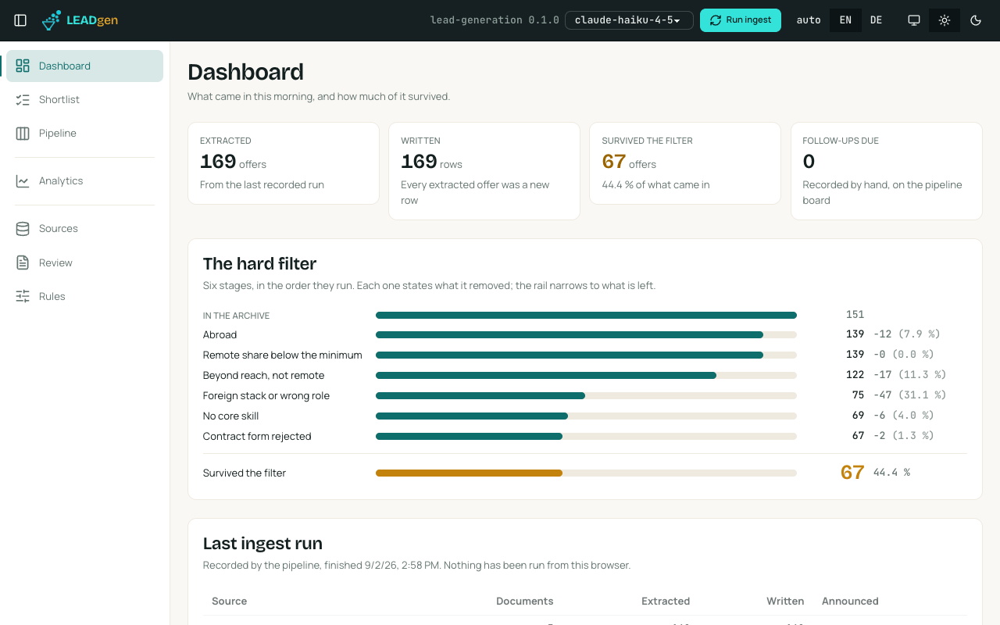
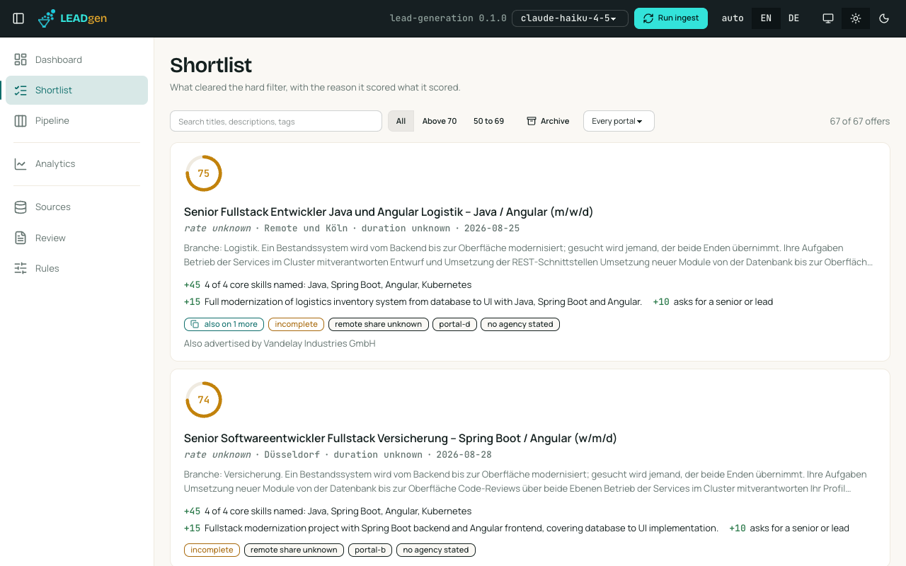
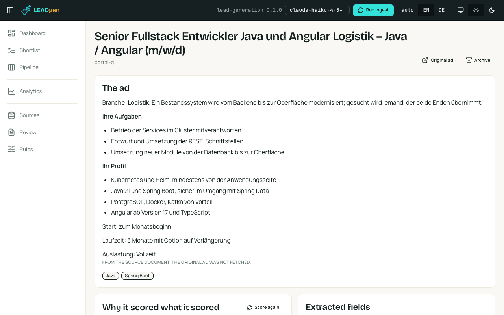
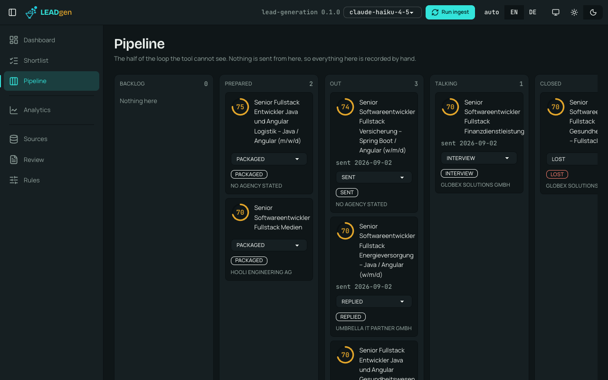
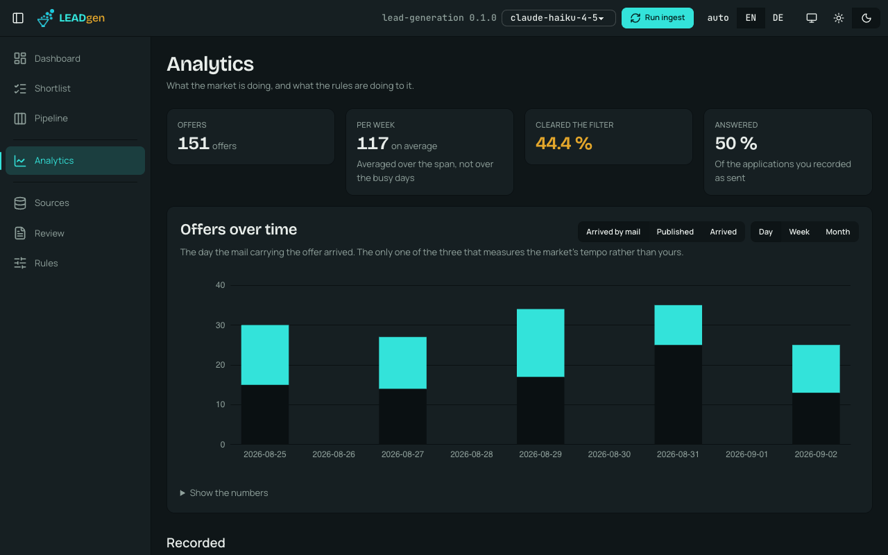
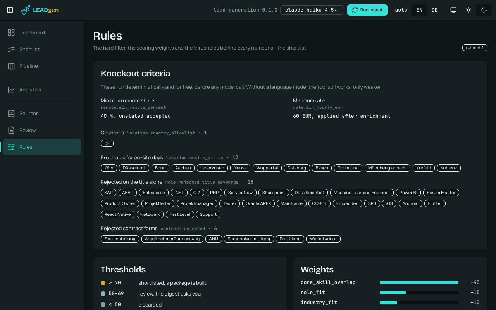
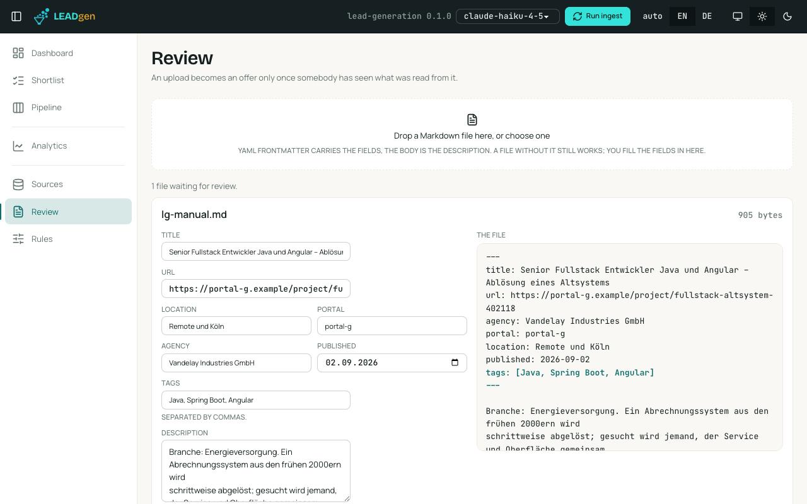

# leadgen

**An acquisition tool for freelancers.** It collects project offers from sources you
configure, throws away four in five for free with deterministic rules, scores what is left
against your own profile, and assembles a ready-to-send application package for the
matches. **It never sends anything.**

[](https://github.com/codeministry/leadgen/actions/workflows/ci.yml)
[](LICENSE)
[](#status-alpha-and-still-being-built)
[](backend/build.gradle.kts)
[](gradle/libs.versions.toml)
[](frontend/package.json)



---

## Status: alpha, and still being built

Read this before you rely on it.

- **It has never run anywhere but its author's machine.** There is no released version, no
  upgrade path, and no promise that a database written today is readable next month.
- **The API and the configuration schema will change** without a deprecation period.
- **It is single-operator by design.** There is no authentication (`security.auth` accepts
  only `none`), no multi-tenancy, and the only thing standing in front of the write
  endpoints is that the server binds `127.0.0.1` by default. Do not expose it.
- **Known gaps** are listed under [What does not work yet](#what-does-not-work-yet), not
  hidden.

**This was built with AI-assisted coding, on purpose and openly.** I need this tool myself:
sorting project offers by hand was costing me an hour a day, and an hour a day is not
something you spend six months building your way out of. AI coding is what made it possible
to have a working pipeline in days instead of months — designed, reviewed and measured by
me, written fast with an agent.

Two consequences worth knowing before you judge the code. It reads unusually densely: the
comments carry the reasoning and the measurement behind each decision, because that is what
keeps a decision from being undone by the next change. And every number quoted in this
README was measured rather than estimated — the scripts that measured them are in
`docs/samples/`, and where a claim could not be measured, it says so.

---

## Why

Project offers arrive as newsletters, portal feeds and direct enquiries, and the same
project often comes through several agencies at once. Reviewing them costs an hour a day
and produces nothing durable. Assembling the documents costs it again for every single
application. Both of those are automatable. **The decision to apply is not**, and it is
exactly the part that currently gets the least attention, because the sorting eats the time.

The numbers come from 14 real newsletter mails:

| Measured | Value | What follows from it |
|---|---:|---|
| Offers in 14 mails | **1289** | Reading them by hand is the actual cost |
| Removed by rules alone, no model | **80.9 %** | The expensive stages only ever see the rest |
| The same project through several portals | **12.3 %** | Collapsing them is worth a stage of its own |
| Offers stating an hourly rate | **0.0 %** | A rate rule before enrichment filters everything or nothing |
| Offers stating a remote share | **8.8 %** | Most of what you want to filter on is not in the listing |

That last pair is why there is a stage that fetches the original ad, and why the rate rule
is *configured* to run after it — the loader refuses any other value.

## How it works

```
Sources ─▶ Ingest ─▶ Extract ─▶ Dedupe ─▶ Filter ─▶ Archive ─▶ Enrich ─▶ Score ─▶ Package ─▶ Digest
                                                        │          │         │
                              free, deterministic ──────┘          │         │
                                        the only stage that leaves ┘         │
                                                the only stage that costs money
```

Two rules decide the shape of everything above.

**Rules before model.** Six deterministic knockout stages run first, in a fixed order,
with no network and no language model: abroad → remote share → out of reach → role or
stack → no core skill → contract form. An offer stops at the first rejection and carries
that verdict, so the funnel adds up and you can always ask why something is missing.
Without an API key the tool still runs; it loses the score total and the cover letter,
nothing else.

**Nothing is wired in.** Not one CSS selector, keyword, weight or portal is written in
Java. A new offer source is a block of YAML, including its extraction rules down to the
selector and the date format. There is a test that reads the repository for `Transport.send`,
`JavaMailSender`, `setRecipient(` and `mailto:` and fails the build if a send path ever
appears.

## Try it in one command

The repository ships a complete **invented** dataset — five newsletter mails carrying ~170
fictional offers from `portal-a`…`portal-f` and agencies called Acme, Initech and Globex —
so a fresh clone opens on a populated application instead of six empty screens.

```bash
git clone git@github.com:codeministry/leadgen.git
cd leadgen
cp .env.example .env    # the file has to exist; it may stay exactly as it is
docker compose -f docker-compose.yml -f docker-compose.demo.yml up --build
```

Open <http://localhost:4200> and press **Run ingest** once. Details, and how to regenerate
the corpus, are in [`demo/README.md`](demo/README.md).

Two things the demo cannot fake, both by design: without an `LLM_API_KEY` the shortlist is
there and filtered but the score *total* is withheld rather than computed from half the
weights, and enrichment has nothing to fetch because the invented URLs do not resolve.

## The screens

| | |
|---|---|
|  | **Shortlist** — what cleared the hard filter, each entry carrying the reason it scored what it scored, with duplicate portals collapsed into one row. |
|  | **Offer detail** — the ad as Markdown, every score reason, the extracted fields, the application package, and the status control. |
|  | **Pipeline** — the half of the loop the tool cannot see. Nothing is sent from here, so everything here is recorded by hand. |
|  | **Analytics** — what the market is doing, and what the rules are doing to it. |
|  | **Rules** — the hard filter, the weights and the thresholds behind every number on the shortlist. |
|  | **Review** — an upload becomes an offer only once somebody has seen what was read from it. |

## Configuration

Two layers, the same way Spring's own works. Working defaults ship on the classpath under
`backend/src/main/resources/leadgen/` and are part of the jar; the directory named by
`leadgen.config-dir` overrides them **file by file**. The tool therefore runs on a fresh
clone with no configuration at all, and nothing individual is ever baked into the artifact.
The startup banner names, per setting, which layer won and where the value came from —
with credentials masked.

| File | What it decides |
|---|---|
| `sources.yaml` | Where offers come from, and how a document is read: the block selector, every field, the date format, the tracking-proxy parameter. A new source is a block here. |
| `matching-rules.yaml` | The six knockout stages, the scoring weights and penalties, the shortlist thresholds, deduplication and follow-up. |
| `skill-profile.yaml` | Who is applying: skills with weights and aliases, industries, reference projects, and which CV goes with which language. |
| `pipeline.yaml` | The process: model and provider, enrichment, packaging, digest. Named `pipeline.yaml` and not `application.yaml`, which belongs to Spring alone. |

Credentials never appear in any of them. Every value is a `${PLACEHOLDER}` resolved from
`.env`, which is gitignored, and so is `config/`. See
[`.env.example`](.env.example) for the full list.

## What does not work yet

Named rather than hidden, because a gap you find yourself is worse than one you were told
about.

- **No CI run yet.** The workflows are written and the tooling is in place — Spotless,
  JaCoCo, ESLint, Stylelint, Vitest, all behind one `./gradlew check` — but nothing has run
  them on a push, because nothing has been pushed.
- **Reading a mailbox writes to it.** The IMAP source is Spring Integration's
  `ImapMailReceiver`, which remembers what it has handed over by setting a user flag on each
  message. Nothing the owner sees is touched — no `\Seen`, no `\Flagged`, no `\Deleted` —
  but it is a write, and an earlier implementation kept its own cursor and made none. The
  consequence is that widening a too-narrow subject filter no longer makes the mails behind
  it reachable again.
- **Only `exact_fingerprint` deduplication is implemented.** The two embedding strategies
  are read, logged and skipped. And the fingerprint is the normalized title alone, so two
  genuinely different projects that share a title do merge; the fields that would tell them
  apart come from enrichment, which runs later.
- **The LLM is used for four factors only** — role fit and three penalties. `llm.models`
  lists `extraction`, `writing` and `embedding`; none of the three is read today, and the
  shipped file says so.
- **The batched scoring path is hand-written HTTP.** Spring AI has no batch abstraction, so
  the half-price asynchronous path talks to the provider directly while the synchronous one
  goes through `ChatClient`. Two mechanisms for one question, and it is the reason the
  provider list for batching is one name long.
- **A cursor table nobody reads.** `ingest_cursor` and the two classes around it are left
  over from the IMAP connector's previous design.
- **`remote.accept_unknown` is displayed and never read.** Setting it to `false` changes
  nothing.
- **No Helm chart.** Docker Compose is the supported way to run this.
- **The corpus tests skip on a fresh clone.** They assert against 14 real newsletter mails
  that are gitignored for privacy; `ExtractionTest` covers the same mechanics against a
  fixture that ships.

## Development

```bash
./gradlew check                # both modules: Spotless, backend tests, frontend lint + tests
./gradlew :backend:test        # Spring tests — needs a running Docker for Testcontainers
./gradlew :backend:bootRun     # API on :8080, reads the untracked .env from the repo root
docker compose up postgres     # the database a local run expects

cd frontend
bun run start                  # dev server on :4200, proxies /api to API_PROXY_TARGET
bun run check:static           # ESLint, Stylelint, tsc — after every change
bun run test                   # Vitest
```

**bun, never npm or npx.** The frontend is bracketed into Gradle with plain `Exec` tasks so
`package.json` stays the single list of frontend commands.

## Documentation

- [Architecture](docs/ARCHITECTURE.md) — the pipeline stage by stage, and the reasoning
  behind the parts that are not obvious
- [Configuration](docs/CONFIGURATION.md) — the two layers, the four files, every variable
- [Adding a source](docs/ADDING-A-SOURCE.md) — a new source is a YAML block, worked through
  line by line
- [Development](docs/DEVELOPMENT.md) — prerequisites, commands, and the traps a newcomer
  hits first
- [Concept](docs/CONCEPT.md) — the original design: domain model, module layout, order of work
- [Sample analysis](docs/SAMPLE-ANALYSIS.md) — what 14 real newsletter mails contain, and
  what they do not
- [The demo](demo/README.md) — the invented dataset and what it demonstrates
- [`CLAUDE.md`](CLAUDE.md) — the working notes: every invariant, and the measurement behind
  each one. Written for an AI agent, and the most complete description of why this code
  looks the way it does.

## Contributing

Issues and pull requests are welcome — see [CONTRIBUTING.md](CONTRIBUTING.md). Two
invariants a change must not break: **nothing is ever sent**, and **no vendor, portal,
provider or personal datum enters a committed file**. Both are enforced by tests.

## License

[Apache License 2.0](LICENSE). See [NOTICE](NOTICE).
