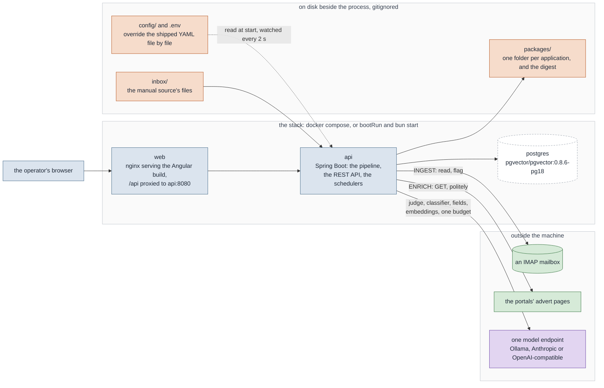
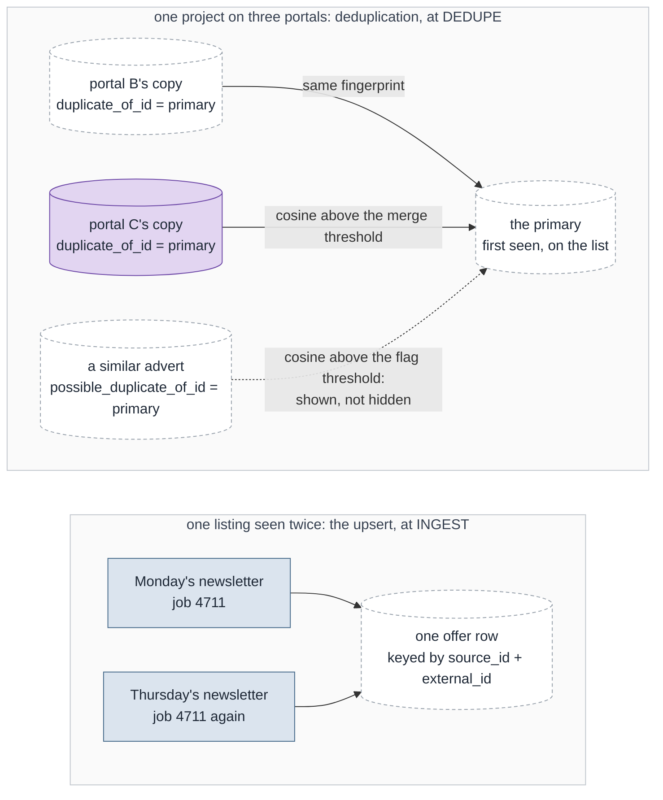
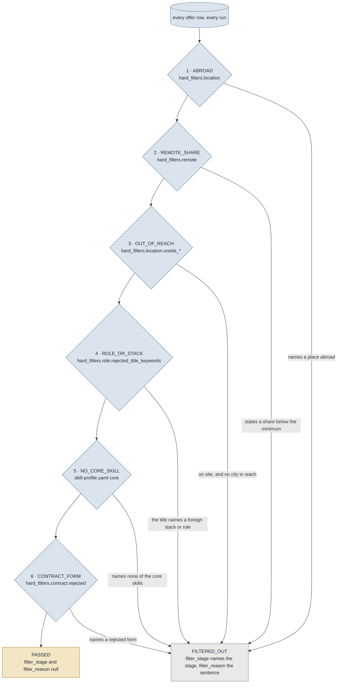
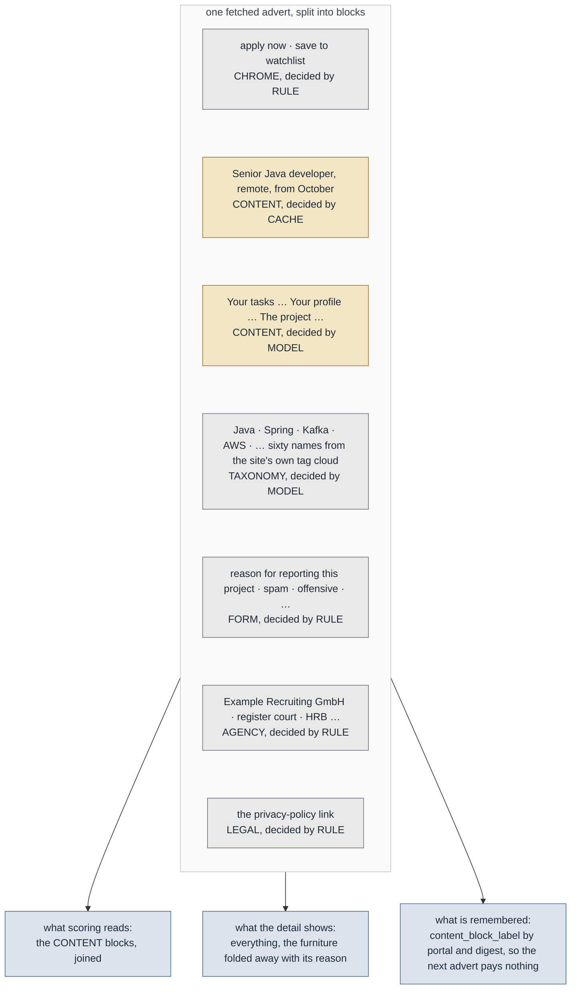
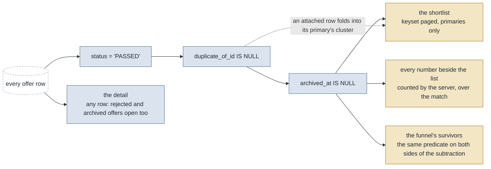
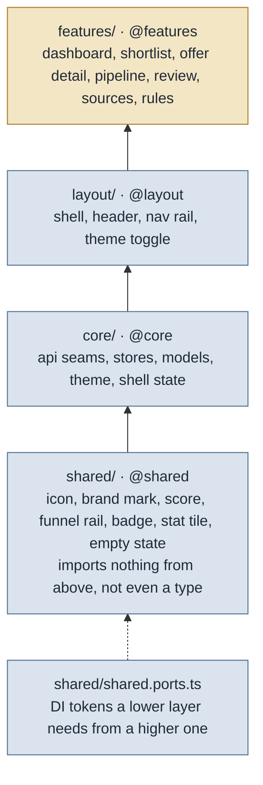

# Architecture

What this is, stage by stage, and the reasoning behind the parts that are not obvious.

[`CLAUDE.md`](../CLAUDE.md) carries the invariants, with the conventions and the traps in
[`backend/CLAUDE.md`](../backend/CLAUDE.md) and [`frontend/CLAUDE.md`](../frontend/CLAUDE.md),
and [`docs/decisions/`](decisions/)
holds the reasoning stage by stage — every rule with the measurement behind it, written for an
agent working in the tree. This document is the same material arranged for somebody reading
the repository for the first time. The tables and who writes each column are in
[`DATA-MODEL.md`](DATA-MODEL.md); the run as a sequence, the asynchronous side and every
write path from an endpoint down are in [`BACKEND-FLOWS.md`](BACKEND-FLOWS.md).

## Shape

A modular monolith, one database, two deployables.

```
backend/    Spring Boot 4.1 · Java 25 · Gradle · JDBC + Flyway · PostgreSQL 18
frontend/   Angular 22 zoneless · @ngrx/signals · Tailwind 4 / DaisyUI · Transloco · bun
demo/       an invented dataset, so a fresh clone opens on a populated application
config/     yours — overrides the shipped defaults file by file (gitignored)
docs/
```

Three processes, three things outside the machine, and three places on disk. Everything the
tool reads or writes is in this picture, and the colours are the ones every diagram in
`docs/` uses: green leaves the machine, violet asks a model, peach is a file.



The root Gradle build brackets both modules: `./gradlew check` runs the Spring tests and the
frontend's lint and tests in one call. The frontend is wired in with plain `Exec` tasks
calling `bun`, not with the Node Gradle plugin — the plugin does not speak bun, and this
keeps `package.json` the single list of frontend commands.

**JDBC, not JPA.** The pipeline writes offers in batches and upserts them with
`ON CONFLICT`, which is one statement of plain SQL against a schema Flyway owns. An ORM
would add a mapping layer over Postgres arrays for no gain. Flyway is therefore the only
thing that touches the schema.

## The pipeline

`IngestService.run(scoringModel)` is the orchestrator, and **the order is the design**.

| #   | Stage        | Owner                             | Why it sits here                                                                                                                                     |
|-----|--------------|-----------------------------------|------------------------------------------------------------------------------------------------------------------------------------------------------|
| 0   | Model check  | `score.ScoringService#checkModel` | Before everything, so an unknown model is not discovered *after* a whole pass has been paid for.                                                     |
| 1   | Fetch        | `ingest.connector.*`              | Per source. One failing source must not end the run.                                                                                                 |
| 2   | Extract      | `ingest.extract.*`                | Strategy read from configuration, never assumed.                                                                                                     |
| 3   | Map + upsert | `OfferMapper`, `store.OfferStore` | `ON CONFLICT (source_id, external_id)` is what makes re-reading a newsletter free.                                                                   |
| 4   | Deduplicate  | `dedupe.DeduplicationService`     | Globally, after all sources: a pass scoped to one source would never see the pair it exists to collapse.                                             |
| 5   | Hard filter  | `filter.FilterService`            | Free and deterministic, so everything expensive sees a fifth of the input.                                                                           |
| 6   | Archive      | `archive.ArchiveService`          | After the filter so a restored offer carries a current verdict; before enrichment so an offer off the list pays for neither the fetch nor the model. |
| 7   | Enrich       | `enrich.EnrichmentService`        | The only stage that leaves the machine, and only for survivors.                                                                                      |
| 8   | Content      | `content.ContentService`          | After enrichment because it reads the fetched advert; before scoring because scoring has to judge the advert and not the portal around it.           |
| 8a  | Fields       | `fields.FieldsService`            | After content because it reads the advert the content stage left; before scoring because what it writes feeds `project_setup` and the judge's view.  |
| 9   | Score        | `score.ScoringService`            | Deterministic factors always; a model for four of them.                                                                                              |
| 9a  | Retrieval    | `retrieval.RetrievalIndexService` | After scoring on purpose: its first pass over a corpus is hundreds of requests, and in front of the judge it would starve the stage the tool is for. |
| 10  | Open         | `application.ApplicationService`  | A card at `NEW` per offer above the shortlist threshold. What reaching the shortlist buys; the folder waits for a person.                            |
| 10a | Package      | `packaging.PackagingService`      | The retry for a folder somebody asked for and did not get. Normally zero: a package is built when an application reaches `PACKAGED`.                 |
| 11  | Digest       | `digest.DigestService`            | A file, and the last thing a run does.                                                                                                               |
| 12  | Record       | `analytics.PipelineRunRecorder`   | Last, and it cannot throw: a history row is worth less than the run. Writes the per-stage timings `StageLog` collected, as `COMPLETE` or `AWAITING_BATCH`, or as `FAILED` after a stage threw. |

What each stage selects and which columns it writes is the table in
[`BACKEND-FLOWS.md` § 1a](BACKEND-FLOWS.md#1a-stage-by-stage); where a rule decides and where
a model speaks, per stage, is § 1e of the same document.

### Ingest and extraction

No selector is written in Java. Block selector, every field, the date format and the
tracking-proxy parameter come from the source's `extraction` block — that is what makes a
new source a YAML block. See [ADDING-A-SOURCE.md](ADDING-A-SOURCE.md).

Three things that are easy to get wrong and silent when you do:

- **`expect_count_from_subject` is the only check nothing else can make.** A selector that
  stops matching loses offers, and fewer offers is indistinguishable from a quiet market.
- **The IMAP side is Spring Integration's `ImapMailReceiver`, used without a channel or a
  poller.** A run here is a synchronous pull that has to come back with per-source counts,
  and an inbound channel adapter has nothing to hand back. Three things about it are not
  documented near the setter that causes them, and each one silently yields zero documents
  from a mailbox that is perfectly fine: it needs `@EnableIntegration`'s infrastructure beans
  or it fails on `integrationEvaluationContext`; with `autoCloseFolder` on it closes the
  folder before a body can be read; and with it *off* `receive()` hands back Spring messages
  rather than `jakarta.mail` ones.
- **`mail.imap.peek` is still set, and still for the same reason.** `shouldMarkMessagesAsRead`
  off is not enough on its own: fetching a body otherwise issues `FETCH BODY[]` and the
  server sets `\Seen` regardless. Measured against a real IMAP server.

**What moving to the receiver gave up, deliberately.** Progress used to be a
`UIDVALIDITY`/`UID` watermark kept on this side, and the mailbox was never written to at
all. The receiver marks each message it hands over with a user flag instead. So the tool now
writes one flag per fetched message into a mailbox its owner also reads; "a message the
selector skipped is not progress" is gone, because the flag lands on everything the
*search* returned before the sender, subject and age rules are applied; and a recreated
folder has no equivalent of the `UIDVALIDITY` reset. What still holds is that no `\Seen`,
`\Flagged` or `\Deleted` is ever set, which is the part visible on a phone.


### Two kinds of duplicate

They are different things and the words are worth keeping apart.

- The **upsert** collapses one *listing* seen twice — a newsletter repeats what is still
  open, so re-reading is the normal case. 1289 extracted offers become 1280 rows.
- **Deduplication** collapses one *project* several portals advertise at once. That is
  14.0 % of the measured corpus, and it is the reason the shortlist is readable.



An attached copy stays a row and keeps its own portal and URL; the shortlist shows the
primary with every portal of its cluster beside it. The flag is the honest answer between
the threshold that is safe to act on and the one that is not, and a person resolves it.

The fingerprint is the normalized title and nothing else, and that is measured rather than
lazy: adding the one other field that exists at this point — the stated location — collapses
127 instead of 180, and the 53 it gives up are overwhelmingly correct merges lost to the
same ad writing "Nürnberg" in one portal and "Remote und Nürnberg" in the next. **A field
that is present is not the same as a field that is comparable.** The consequence is
accepted rather than hidden: two genuinely different projects sharing a title do merge.

### The hard filter

Six stages in a fixed order: abroad → remote share → out of reach → role or stack → no core
skill → contract form. An offer stops at the first rejection, which is the only reason the
per-stage counts sum to the total. The verdict — stage *and* reason — is written on the
offer, because a rejection without its reason is a number nobody trusts a week later.



Not one keyword is in Java. `docs/samples/simulate_filter.py` is the reference
implementation and a corpus test asserts the two still agree. Which key drives which stage,
and how to change one, is in [WRITING-RULES.md](WRITING-RULES.md).

Three defects that each moved the survivor count by hundreds, all silent, all now fixed in
one place (`TextFold`): an umlaut fold that left `ko ln` and lost every Köln offer;
substring matching where `ch` rejected Aachen and `ANÜ` hit Planung; and unfolded patterns
compared against folded text, where `.net` and `c#` matched nothing at all. **Fold, then
match on word boundaries.**

`onsite_cities` is a list and not a radius, because an offer states its location as free
text — "Remote und Nürnberg", "DE 7XXXX" — so a kilometre figure would need a dataset, a
parser and a network call this stage must not need. And `min_remote_percent: 0` switches
the reach rule off entirely: zero required remote share means being on site is acceptable,
and then it is acceptable anywhere.

### Age is not a verdict

`FilterStage.STALE` used to be a seventh stage and is now the archive. "Too old" is not a
judgement about an advert — an old advert is a good advert nobody will answer any more —
and a verdict is what the funnel reports.

The archive is an axis, not a status. It cannot be a value in `offer.status`, because the
filter reads the whole table with no `WHERE` and writes a verdict onto every row; an
`ARCHIVED` status would be overwritten by `PASSED` on the next run, silently and only for
the offers that still pass. Two columns, because there are four states: `archived_at` with
`AGE` or `MANUAL` is off the list, both null is on it, and `archived_at` null with
`RESTORED` is on it *deliberately* — which is what stops the age pass taking it back off
tomorrow morning. Both axes, with every move between the four states, are drawn in
[`BACKEND-FLOWS.md` § 4](BACKEND-FLOWS.md#the-offers-verdict-and-its-archive-axis).

The working-set predicate is therefore three parts —
`status = 'PASSED' AND duplicate_of_id IS NULL AND archived_at IS NULL` — at every one of
the twelve sites that count survivors. The funnel needs it on **both** sides of the
subtraction or `survived` goes negative; measured at **-45** before it did.

### Enrichment

The only stage that leaves the machine, and it **never discards**. A fetch that is
forbidden, rate-limited, unreachable or unreadable leaves the offer in the pipeline with a
note saying why: scoring then judges an incomplete offer as incomplete, which someone can
review, while an offer that quietly stopped existing cannot be.

Four gates, cheapest first: cache, `robots.txt`, rate limit, network. Failures are cached
and timeouts are not — a 403 is a fact about the page, a timeout is a fact about the moment.
The rate limit is a sliding window, because twenty a minute has to mean twenty in any sixty
seconds — which is precisely why it is not Resilience4j's, whose `RateLimiter` resets its
permits at fixed cycle boundaries and would allow forty across one. Retry is Framework 7's
`RetryTemplate`: two attempts with backoff, on a transport failure or a 5xx and never on a
4xx, and wrapped around the network call alone. Around the fetch it would retry past the
cache and past the rate limiter, spending tokens the limiter had already refused. An unreachable `robots.txt` means allowed, which is the convention and also the
safer failure: the alternative is a host that silently stops being enriched while its offers
merely look incomplete.

Every enriched column is nullable and **null means "not stated", never zero** — the whole
reason this stage exists is that the sources state a rate in 0.0 % of offers.

### Content segmentation

A page fetched from a portal carries the portal with it: a meta row, an apply button, a report dialog with its four
radio labels, and a tag cloud of technology names taken from the site's own taxonomy rather than from the client's
requirements. Measured on one live offer, sixty such names sat in a single block — and `RuleScorer` folds the advert
into one haystack for skill matching, so they counted as skill overlap and moved offers onto the shortlist. **This is a
fix to the score before it is a fix to the screen.**

**The model is the authority; determinism is a cache in front of it, not a filter above it.**
The obvious arrangement — selectors that strip known furniture, a model for the rest — is the wrong way round here, and
the corpus is why: one portal is 88 % of the offers, so a per-portal selector table is a maintenance bet on one site's
markup, and a selector that stops matching fails *silently*, which reads as a cleaner advert. And the part that costs
the most is unreachable by any selector at all — the recruiter's standing signature, the postal address, the company
register, the privacy link, sits *inside* the description container and differs per agency.

So the advert is split into Markdown blocks, each one normalised and hashed. A block is decided by a configured pattern,
by what its digest was decided to be for an earlier offer, or by a model — in that order. A known digest is free; an
unknown one costs one model call and is free from then on. A portal repeats the same report dialog in every one of its
ads, so it is paid for once and covers the rest. **A header form nobody has seen is a digest nobody has seen: one call,
then free again, which is how new furniture gets noticed by construction rather than mislabelled in silence.**



**Fail open, always.** A block no rule matched, that the cache does not know and that no model answered about stays
`CONTENT` and stays on the screen. `content_undecided` counts exactly those, and it is the number to watch: it is what a
changed markup looks like from here.

`content_block_label` is scoped by portal and deliberately **not** keyed by the model that answered. A score is a scale,
so two judges are two scales and a model change makes every score stale; a label is a fact about a paragraph, so once
decided it stands and re-labelling is a deliberate act. The `sample` column keeps the first 200 characters, because a
table of hashes nobody can audit is a table nobody trusts.

`offer.full_text` is never edited — it stays the record of what was fetched, and the archived copy in an application
package still prints it. The blocks live beside it in
`offer.content_blocks`, carrying their text inline: a second copy per offer buys a browser that needs no splitter of its
own, indices that cannot slip, and a decision that a later change of mind in the shared cache cannot rewrite behind a
reader's back. Scoring reads the content blocks joined, falling back to `full_text` for an advert nothing has read that
way — which is what lets the stage be switched on against a full table with no migration.

The detail screen hides what was decided against behind a line that says how much and of what kind, and re-opens it
exactly where it stood, muted, with the reason beside it. Over-hiding is therefore visible and one click from being
undone, rather than something to take on trust.

### Scoring

Rules before model, again. `RuleScorer` decides everything the profile and the offer's own
fields can decide, for free. A `Judge` is asked about role fit and three penalties, and
nothing else. The weight table itself, the arithmetic behind the total and the three
thresholds are in [WRITING-RULES.md](WRITING-RULES.md), with the arithmetic drawn; which
factor belongs to which half is the picture in
[`BACKEND-FLOWS.md` § 1e](BACKEND-FLOWS.md#1e-where-a-rule-decides-and-where-a-model-speaks).

- **Unscored is not zero, and not nothing.** With no key the deterministic reasons are still
  written. What is withheld is the *total*: computed from five of nine weights it would not
  be comparable to one from all nine, and the same offer would score differently depending
  on whether a key happened to be configured that morning.
- **The weight table decides, not the answer, and it is read rather than restated.** A model
  awarding itself 900 points for role fit gets exactly what `scoring.weights.role_fit` says.
  The bounds live in one method and the clamp in one other, so the synchronous and the
  batched path cannot disagree.
- **`provider` is a kind, never a default.** It names a wire format; the base URL decides who
  answers, and a provider the code does not know is refused loudly. The wire format itself is
  Spring AI's problem now: the five differences between the two APIs that used to be spelled
  out by hand — the auth header, the version header, the system prompt as a field rather than
  a message, the mandatory `max_tokens`, the answer in `content[]` rather than `choices[]` —
  each failed silently when got wrong, and each is now the provider SDK's.
- **The model is built per run, not wired at startup.** The configuration is hot-reloadable, so
  a key added at five in the afternoon has to start producing scores without a restart. That is
  also why the *starter* modules are deliberately not used: their auto-configuration builds
  every model the module knows at boot, and the OpenAI one failed the whole context trying to
  construct an audio-speech model this application will never call.
- **The answer is read out of every generation, not the first one.** Spring AI emits a model's
  thinking as a generation of its own, ahead of the text, so `content()` alone hands back the
  reasoning and drops the JSON — four missing factors on an offer that looks judged. The same
  trap the raw HTTP version documented, returned through the framework.
- **The batch path is still hand-rolled HTTP.** Spring AI has no batch abstraction; the SDK
  underneath has one only behind its beta surface, and taking it would arrive at the same two
  endpoints this already calls correctly.
- **A judge that fails returns nothing rather than throwing.** One unreachable endpoint must
  not end a run.
- **A run judges what is stale, not everything that ever passed.** Three things make a score
  stale, and they are the three it is only comparable within: never written, a different
  `ruleset_version`, a different `score_model`. The last is not caution about a worse model —
  two judges are two scales, and the shortlist threshold is one number read against both.

### Packaging and the digest

One folder per offer **somebody has decided to answer** — the run opens a card at `NEW` and
builds nothing. The folder holds the fixed CV for the ad's language, a Freemarker
cover letter using the reference projects the offer's own skills selected, the archived
original, and a `meta.json` carrying the decision — score, every reason, the matched skills,
and every portal in the duplicate cluster.

The digest is a rendered file and the last thing a run does. **There is no transport, no
recipient and no channel anywhere**, in the code or in the configuration schema, and
`NothingIsSentTest` reads the repository to keep it that way. It is also where a send button
would arrive one convenient afternoon: the folder is finished and the contact is right there
in `meta.json`.

## The read side

`offer.OfferQueryService`, `analytics.AnalyticsQueryService`, `config.SourceQueryService`.
Read-only, and separate from the stages that write — each stage owns a narrow slice of the
`offer` row, this owns the whole row as a person reads it.



- **The shortlist is primaries only**, and so is everything counted against it. Counting
  duplicates as survivors made the sources screen say 104 where the shortlist showed 96.
- **Paged, keyset, never `OFFSET`.** An offset re-reads and re-sorts everything before it on
  every page, and skips or repeats a row whenever a run rewrites a score between two
  requests. The key is the whole sort tuple `(coalesce(score_value, -1), ingested_at, id)`,
  because score alone is not unique: seven offers at 80 would let a page boundary fall inside
  a tie.
- **Every number printed beside the list is counted by the server, over the match.** The
  portal dropdown and the unscored count were derived from the loaded entries once, so they
  told a smaller truth the further you scrolled — while sitting next to a sentence about the
  whole archive.
- **The detail is not restricted to survivors.** It is also how somebody opens an offer the
  filter rejected and asks whether the rule was right.
- **`source_run` exists because nothing else can answer the announced-versus-extracted
  question.** The number of documents, and the count a document announces about itself, leave
  no trace in the `offer` table.
- **The sources screen lists the configuration, not the database** — a misconfigured source
  being invisible is exactly the failure somebody is looking for when they open that screen.

### The prompts on the Rules screen

`/api/v1/prompts` hands over both system prompts **rendered**, not as templates. That screen
already carries the weight table, the knockouts and the thresholds — the deterministic half of
a score — and the prompt was the one input to the decision with nowhere to look it up.

Rendered rather than templated, because the two things worth checking are exactly the two that
get substituted in: whether the configured bounds reached the text, and whether the profile
behind "this developer" is the one in `skill-profile.yaml`. Both have been wrong in this
repository before — the prompt once described three hard-coded skills of the twenty-nine the
profile carries, and the four bounds were once Java constants matching the weight table by
coincidence. Neither would have been visible in a template.

The second block on each prompt is the *shape* an offer arrives in, produced by the same
`describe(...)` the pipeline calls, with placeholder values. A sample written out beside it
would be a second description of that method and would drift from it silently.

Nothing here needs an API key, and none is shown: a prompt is a fact about the configuration,
not about whether anybody can currently be asked it. Both prompts name the same model, and the
screen saying so twice is the point — `llm.models.scoring` is read by two stages.

## Manual status capture

The half of the loop the system cannot observe. Eleven states across five lanes, every change
an event row, because a single mutable row cannot answer "when did I send this" after the
second correction.

**The operator is the authority, so no transition is refused.** A project can be lost before
it was ever answered, and a mistyped status has to be correctable without an argument. What
*is* checked is that the values make sense together: moving to a sent state with no date gets
today, and a closing status drops the follow-up. A board that argues is a board nobody
updates, and it is the only place this state exists.

## Frontend

Strict layering `shared` → `core` → `layout` → `features`, crossed only through the tsconfig
aliases, because that is what the `no-restricted-imports` rule matches on — a relative
`../../core/...` slips past it. `shared/` imports nothing from the layers above it, not even
types; where it needs one (the score thresholds, the chart palette) it takes a token provided
from `core`.



An arrow is an allowed import direction, and each layer's `no-restricted-imports` entry
names exactly the aliases above it.

Standalone components, signals, `OnPush`, zoneless. RxJS only at the I/O boundary, bridged in
with `toSignal`. NgRx stores are a `*.store.ts` + `*.events.ts` pair with `withReducer` and
`withEventHandlers`; where the I/O is the DOM rather than HTTP — theme, language — `withHooks`
plus an `effect` replaces the event handlers, for the same reason.

**Nothing in the browser names a weight, a stage or a source type.** `scoring.weights` is an
open map, the stages are the `FilterStage` enum, a source's `type` is whatever the YAML
declares. A union type in TypeScript for any of them disagrees with the server the first time
one is added, and the symptom is a compile error in a component that has no business knowing
about the filter.

**No prose is written in TypeScript.** A nav item, a band filter and a field row carry a
catalog key; a sentence assembled in a component returns a key and its parameters, because
the number sits in a different place in every language. Plurals are ICU. English is the
fallback because English is this repository's language — and because Transloco's missing
handler returns the key, which is what lets a plain-text sentence from the server render as
itself.

**The server's own prose is not translated, and that is the boundary.** Filter-stage
descriptions, lane labels and score reasons arrive as English sentences from the API and stay
English in both languages. Translating them means the API handing over an id and the browser
holding a catalog keyed by it, which is the one thing the read side deliberately does not do.

### The design system

Two DaisyUI themes, `lg-light` and `lg-dark`, declared in `src/styles.css` with DaisyUI's own
built-ins switched off so they do not ship dead. Palette petrol and ochre, all values OKLCH.

**Ochre means one thing: this survived the filter.** Petrol carries structure and
interaction, everything discarded is muted, and nothing else may take the accent. The score
bands follow it, with the middle band on `secondary` rather than `primary` — the dark primary
is the logo's bright cyan and would outshine the ochre, and the middle band must never be the
loudest thing on the screen.

`--color-accent` is a fill and a large-number colour, never body text: it is 3.05:1 on the
sand page and fails AA below 24 px, which is why `--lg-accent-text` exists at 4.68:1.

The header carries `data-theme="lg-dark"` in **both** themes, because the logo asset has its
own bright cyan which is 1.6:1 on white and cannot be a light-theme colour at any size.
DaisyUI's themes are attribute-scoped, so nesting the attribute re-declares every token for
that subtree and the buttons, the version string and the two-tone wordmark all follow with no
override anywhere.

`system` is the *absence* of `data-theme`: DaisyUI emits `lg-dark` under
`:root:not([data-theme])` inside a `prefers-color-scheme` query, so removing the attribute
*is* "follow the operating system". An inline script in `index.html` applies the stored
preference before first paint.

## Where to start reading

| If you want to understand… | Read |
|---|---|
| how an offer becomes a row | `ingest/IngestService.java`, then `ingest/extract/HtmlBlockExtractor.java` |
| why four in five are discarded | `filter/HardFilter.java` and `matching-rules.yaml` |
| how a score is made | `score/RuleScorer.java`, then `score/ChatClientJudge.java` and `score/AnthropicJudge.java` |
| how configuration is loaded | `config/ConfigRegistry.java` and `config/ConfigLoader.java` |
| how a screen gets its data | `offer/OfferQueryService.java` and `core/store/` |
| which table a stage writes, and who else reads it | [`DATA-MODEL.md`](DATA-MODEL.md) § 3 and § 4 |
| what happens after `PATCH /api/v1/applications/{id}` | [`BACKEND-FLOWS.md`](BACKEND-FLOWS.md) § 2b and § 3 |
