# Backend flows

What happens, in order, when work starts: the pipeline run as a sequence with what every stage
reads and writes, the work that happens outside the run, every write path from an endpoint
down to a table, and the four state machines the schema holds. Entry points are named by file
and method so a breakpoint can go where the text says. The tables themselves are in
[DATA-MODEL.md](DATA-MODEL.md); the reasoning behind each stage is in `decisions/` and is
linked, not repeated.

> [!NOTE]
> Derived from the code under `backend/src/main/java/de/codeministry/leadgen/`. Where a
> diagram and a class disagree, the class wins and the fix is here. The diagrams share one
> colour scheme, described in [README.md](README.md#conventions-in-the-guides): grey-blue is
> deterministic and free, violet asks a model, green leaves the machine, peach writes a file.

## 0. Entry points

Everything the backend does starts in one of these places. There is no other thread and no
other trigger.

| Starts when | Where | What it starts |
|---|---|---|
| somebody presses *Run* | `POST /api/v1/ingest?model=` in `web/IngestController` | `ingest/IngestService.run(model)`, the whole pipeline, § 1 |
| the cron fires | `ingest/ScheduledPass.run`, `@Scheduled(cron = "${leadgen.ingest-cron:-}")` | the same method; off by default, because `-` is Spring's disabled marker |
| every five minutes | `ingest/ScoreBatchCollector.poll`, `fixedDelay` `leadgen.score-batch-poll-interval`, default `PT5M` | collects finished scoring batches and finishes the run that submitted them, § 2a |
| every two seconds | `config/ConfigWatcher.pollForChanges`, `leadgen.config-poll-interval`, default `PT2S` | reloads the four YAML files when one changed on disk, § 2c |
| an application moves to `PACKAGED` | `packaging/PackageWorker.onPackageRequested`, `@Async @TransactionalEventListener(AFTER_COMMIT)` | builds that one folder, § 2b |
| offers are archived by hand | `packaging/PackageWorker.onOffersArchived`, the same annotations | discards their folders, § 2b |
| the application has started | five `ApplicationReadyEvent` listeners and one `ApplicationRunner` | banners, the abandon sweep, the orphan sweep, the inbox directories, § 2c |
| somebody writes from a screen | the ten endpoints in § 3 | one transaction each, and at most one event |

`@EnableScheduling` and `@EnableAsync` are both on `LeadGenerationApplication`. Every
`@Scheduled` method and both `@Async` listeners depend on them, so removing either switches
off a whole column of this table without a compile error.

## 1. The run

`IngestService.run(model)` takes a `ReentrantLock` with `tryLock` and throws `AlreadyRunning`
when it cannot, which the controller turns into a 409. Nothing queues: a second run is the
same work done twice, and the stages rewrite the same rows. Inside the lock, `runOnce` is a
written-out sequence, not a list: eleven fixed stages after one timed stage per enabled
source, and the order is pinned by `IngestOrderTest`. The five numbered phases below are a
reading aid and exist nowhere in the code; the stage names are the ones `pipeline_stage`
records.

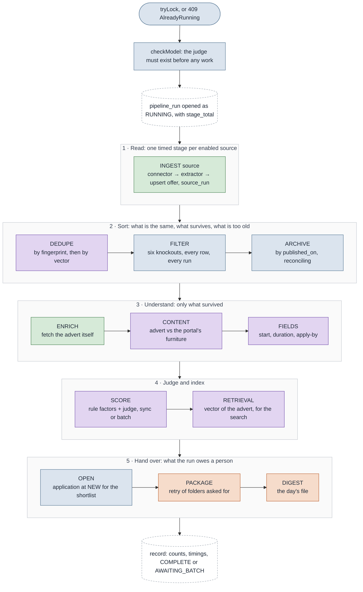

Every stage runs inside `analytics/StageLog.time(name, body)`, which does three things: it
marks the open `pipeline_run` row with the stage's name and position before the work, so the
dashboard can say what is happening; it records a `StageTiming` after the work; and on a
`RuntimeException` it records the timing as `FAILED` and rethrows. The rethrow matters, and
`runOnce` catches it exactly once, around all the stages. It builds the report from the counts
the run had reached, with each stage it never got to at the value that stage answers when it is
switched off, and calls `history.recordFailure`, which closes the row as `FAILED` with every
timing, the failed one last. Then it logs the trace and rethrows as `IngestService.StageFailed`,
whose message names the stage. The request answers 500 with that sentence, and `ScheduledPass`
logs it. Only a process that dies mid-run still leaves a `RUNNING` row, for the next start to
close as `ABANDONED` (§ 2c).

> [!IMPORTANT]
> The run's status is stated by the caller and never read off the timings. A source is the
> exception to the rule above: an `IngestException` from one connector is caught per source,
> logged, and the run goes on with the next one. Its timing stays `FAILED` under a run that
> closes `COMPLETE`, and the dashboard shows it as a red row under a run that completed.

### 1a. Stage by stage

The predicate column is what the stage selects; the write column is what its `UPDATE offer
SET` names. The model column says whether the stage asks `llm/LlmBudget.take()` before a
request and what happens when the answer is no.

| Stage | Owner | Selects | Writes | Returns | Model |
|---|---|---|---|---|---|
| `INGEST <source>` | `IngestService.ingest`, then `ingest/store/OfferStore` | the source's documents through its `SourceConnector` | `source` (upsert on name), `offer` (upsert on `source_id, external_id`), `source_run` | `SourceIngestResult` | only with the `llm` extraction strategy, one call per document |
| `DEDUPE` | `dedupe/DeduplicationService.run` | every offer inside `deduplication.ttl_days`, by `fingerprint`; with an embedding model, `OfferEmbedder` and `SimilarOffers` | `duplicate_of_id`, `possible_duplicate_of_id`, `embedding`, `embedding_model` | the number attached | one call per 32 adverts to embed, none without `llm.models.embedding` |
| `FILTER` | `filter/FilterService.run` | every row of `offer`, no `WHERE` | `status`, `filter_stage`, `filter_reason`, on every row | `FilterReport` | no |
| `ARCHIVE` | `archive/ArchiveService.run` | rows whose `published_on` is older than `hard_filters.freshness.max_age_days` with no live application; rows aged out that the window reaches again | `archived_at`, `archive_source = 'AGE'`, and back to null | `ArchiveReport` | no |
| `ENRICH` | `enrich/EnrichmentService.run` | `status = 'PASSED' AND archived_at IS NULL AND enriched_at IS NULL AND url IS NOT NULL` | the nine enrichment columns; `fetched_page` through `PageCache` | `EnrichmentReport` | no model; this is the stage that leaves the machine |
| `CONTENT` | `content/ContentService.run` | passed, not archived, `full_text` present, `content_at` null (or `content_model` null once a model exists) | `content_blocks`, `content_at`, `content_model`, `content_undecided`; nulls `score_model` when the blocks changed; `content_block_label` | `ContentReport` | one call per advert with blocks no rule or cache decided; refused, the advert stays due |
| `FIELDS` | `fields/FieldsService.run` | the working set with `fields_at` null or `fields_model` changed | `start_text`, `starts_on`, `duration`, `duration_months`, `apply_by`, `apply_by_text`, `fields_at`, `fields_model`; nulls `score_model` when a value moved | `FieldsReport` | one call per advert; refused, the loop stops and the rest stay due; skipped entirely without a model |
| `SCORE` | `score/ScoringService.run(model)` | the working set with no `score_batch_id` and `scored_at` null or `ruleset_version` or `score_model` changed; separately, rows whose `profile_digest` changed | through `ScoreWriter`: `score_value`, `score_band`, `score_model`, `ruleset_version`, `scored_at` and the `offer_score_reason` rows; `profile_digest`; or a `score_batch` row and `score_batch_id` | `ScoringReport` | one call per advert, or one for the whole batch; refused, the advert is written unscored with its deterministic reasons and stays due |
| `RETRIEVAL` | `retrieval/RetrievalIndexService.run` | the working set with text and `retrieval_embedded_at` null, or the model changed, or `content_at` newer | `retrieval_embedding`, `retrieval_embedding_model`, `retrieval_embedded_at` | `RetrievalReport` | one call per 32 adverts; refused, the rest wait for the next run |
| `OPEN` | `application/ApplicationService.openShortlisted` | the working set at `score_band = 'SHORTLISTED'` with no application | `application` at `NEW`, `application_event` `opened` | `OpenReport` | no |
| `PACKAGE` | `packaging/PackagingService.run` | the working set with `packaged_at` null and an application at `PACKAGED` | a folder under `packaging.output_dir`; `package_dir`, `packaged_at`, `language` | `PackageReport` | `ProfileEmbeddings` may ask the embedding model once to rank the reference projects; refused, the letter uses the lexical ranking alone |
| `DIGEST` | `digest/DigestService.render(today)` | the working set by band, with its reasons | `digest-<date>.txt` or `.html` under `digest.output_dir` | the path | no |

Two stages are easy to misread. `FILTER` re-judges every row on every run because the rules
are hot-reloadable, so a rejection is never final and a rule change moves offers in both
directions on the next pass. And `PACKAGE` inside the run is only the retry: since `V27` the
folder is built when a person moves the application to `PACKAGED` (§ 2b), and the stage
picks up whatever that request could not build.

Why the stages sit in this order is written beside each call in `IngestService.runOnce`, and
the measurements behind it are in
[decisions/pipeline-dedupe-filter.md](decisions/pipeline-dedupe-filter.md),
[decisions/pipeline-enrich-content.md](decisions/pipeline-enrich-content.md) and
[decisions/pipeline-scoring.md](decisions/pipeline-scoring.md).

### 1b. INGEST, one source

The one stage with four collaborators and three table writes. Which extractor reads a document
is the source's decision in `sources.yaml`, not the code's: `extraction.strategy` is one of
`html-blocks`, `markdown-frontmatter` or `llm`, and all three hand back the same shape, a
block per offer keyed by the eight field names, so everything after `OfferMapper` is identical
whether the offer came out of a newsletter or out of a file somebody dropped in by hand.

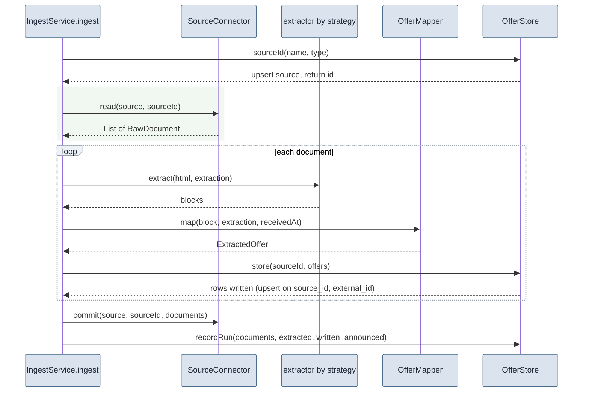

`commit` comes after every document is stored, so a mailbox cursor advanced before a failed
write cannot skip those mails forever. For the file connector it is a no-op; the IMAP
connector's progress flag and what it cost are in
[decisions/pipeline-ingest.md](decisions/pipeline-ingest.md). Two connectors exist, `imap`
and `file`; a source of another `type`, such as the `rss` sample in the shipped
`sources.yaml`, is skipped with a warning naming it, and so is a source whose
`extraction.strategy` is not one of the three above.

> [!WARNING]
> A selector that stops matching loses offers, and fewer offers is indistinguishable from a
> quiet day on the market. The only check that can see it is `expect_count_from_subject`: when
> the source says how to read a count out of the document's subject, `IngestService.check`
> compares it with what was extracted and logs a warning naming both numbers. It is loud and
> not fatal, and the two numbers land in `source_run.announced` and `source_run.extracted`
> where the Sources screen shows them.

### 1c. SCORE, synchronous or batched

The stage forks on one condition: `llm.batch` is on and the current judge is a `BatchJudge`.
Batched, the run ends at this stage as far as scoring is concerned; the answers arrive later
and § 2a finishes what the run left.

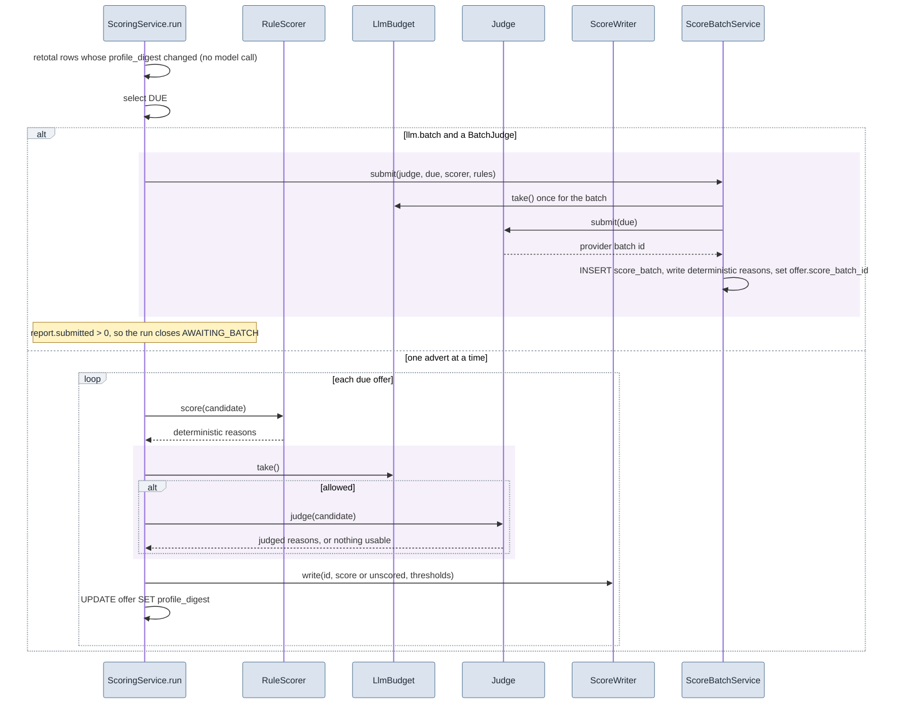

An advert with no usable answer is written unscored, with its deterministic reasons and a null
`score_model`, and is therefore due again on the next run. That is the same outcome as no
judge at all, on purpose: a total from four of five weights is not comparable to one from all
five. `POST /api/v1/offers/{id}/score` runs the same path for one offer without the staleness
guard (§ 3).

### 1d. ENRICH gates and CONTENT deciders

Two stages encode an order that prose states less clearly than a picture. `enrich/AdFetcher`
answers from the cheapest source that can answer, and a failure is cached so it is not
retried every night; a deferral, when the run's fetch budget is spent, writes nothing so the
advert stays due. `content/ContentService` decides every block of a fetched advert by rule,
then by the label cache, then by the model, and a block the model does not answer for is
counted as content rather than dropped.

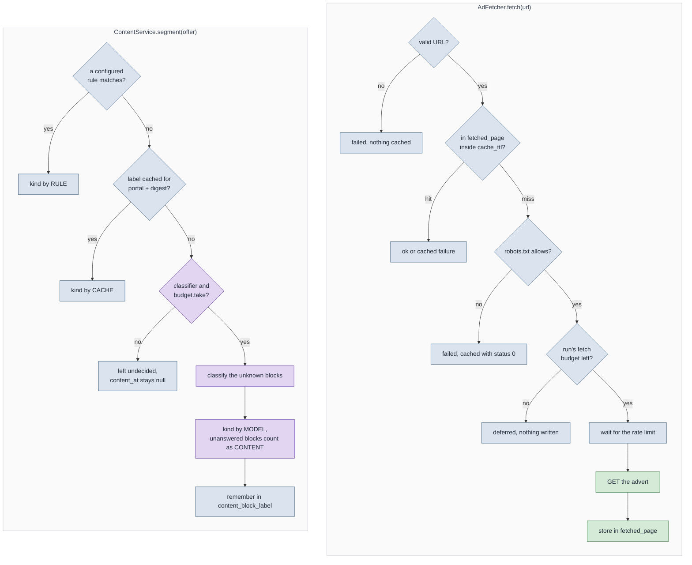

`DEDUPE`, `FILTER`, `ARCHIVE`, `FIELDS`, `RETRIEVAL`, `OPEN`, `PACKAGE` and `DIGEST` are
straight lines and get table rows only; their reasoning is in the decision records the table
links.

### 1e. Where a rule decides and where a model speaks

*Rules before model* is the repository's first invariant, and this is what it looks like
stage by stage: what is decided deterministically, from which file and key, and where exactly
a model is asked, with which model key. Three things hold everywhere. A model never passes or
fails a knockout. A model never merges two offers without a threshold that stands in
`matching-rules.yaml`. And without any model configured the tool still runs every stage; the
column on the right is then empty and the stage says so in its log line.

| Stage | Decided by rule, from | Asked of a model, with | Which one, when |
|---|---|---|---|
| `INGEST` | the source's selectors: `sources.yaml` `extraction.strategy` `html-blocks` with `block_selector` and `fields.*.css`, or `markdown-frontmatter`; `TitleNormalizer` on every title | strategy `llm` reads free prose through `ingest/extract/LlmDocumentExtractor`; a markdown file with `fallback: llm` whose front matter lacks fields goes the same way. Model: `llm.models.extraction`, else `llm.models.scoring` | the source's `extraction.strategy` decides, per source |
| `DEDUPE` | `deduplication.strategies` `exact_fingerprint` with `action: merge`, inside `ttl_days`; the fingerprint is the normalised title plus portal | the two `embedding_cosine` strategies: `merge` at their threshold, `flag_possible_duplicate` at theirs, over a vector of title, location and the teaser's opening. Model: `llm.models.embedding` | rule always; the vector only when an embedding model is named, and only at the thresholds in the file |
| `FILTER` | all six stages, in `filter/HardFilter`: `hard_filters.location` → `ABROAD` and `OUT_OF_REACH`; `hard_filters.remote` → `REMOTE_SHARE`; `hard_filters.role.rejected_title_keywords` → `ROLE_OR_STACK`; `skill-profile.yaml` `core` → `NO_CORE_SKILL`; `hard_filters.contract.rejected` → `CONTRACT_FORM` | nothing, ever | rule only |
| `ARCHIVE` | `hard_filters.freshness.max_age_days` against `published_on` | nothing | rule only |
| `ENRICH` | `enrichment.extract.fields.*.regex` and `full_text.css` in `pipeline.yaml`, read by `enrich/AdExtractor` (strategy `patterns`); the fetch settings under `enrichment.fetch` | nothing; the network, not a model | rule only |
| `CONTENT` | `content.rules` in `pipeline.yaml`, a `kind` per regex → `RULE`; then the label cache → `CACHE` | `content/ContentClassifier` labels the blocks nothing decided. Model: `llm.models.scoring`; prompt in that class, rendered at `GET /api/v1/prompts` | rule first, cache second, model last; an unanswered block counts as content |
| `FIELDS` | `fields.enabled` only; the regex values enrichment wrote stand in until the model overwrites them | `fields/FieldExtractor` reads start, duration and apply-by out of the advert. Model: `llm.models.scoring` | model or nothing: without one the stage skips and says so |
| `SCORE` | `score/RuleScorer`, seven factors: `core_skill_overlap`, `rate_fit`, `seniority_fit`, `project_setup`, `industry_fit`, `interest_fit`, `disinterest_fit`, weighted by `scoring.weights`, matched against `skill-profile.yaml` `core`, `strong`, `peripheral`, `industries`, `interest_topics`, `disinterest_topics`, with `hard_filters.rate.min_hourly_eur` as the rate floor; `scoring.thresholds` turns the total into the band | the `Judge`, four factors: `role_fit`, `stack_mismatch_dominant`, `role_mismatch`, `vague_description`. Model: `llm.models.scoring`, or one of `scoring_options` when the run names it; prompt in `score/ChatClientJudge` and `score/AnthropicJudge`, rendered at `GET /api/v1/prompts` | both, always: the rule half is written even when the judge is silent, and then the offer stays `UNSCORED` rather than totalled from half the weights |
| `RETRIEVAL` | `retrieval.enabled`, `neighbours` and `topic_floor`; the shortlist's lexical filter is the fallback | the whole de-furnitured advert as a vector, for the semantic search only. Model: `llm.models.embedding` | search, never a verdict: what a vector may not decide is in [decisions/retrieval.md](decisions/retrieval.md) |
| `OPEN` | `scoring.thresholds.auto_shortlist`, through `score_band` | nothing | rule only |
| `PACKAGE` | `packaging/ReferenceRanking`: a reference project whose `stack` the advert names is pitched, by `skill-profile.yaml` `reference_projects`; the CV by `cv_variants` and the advert's language; the templates under `packaging.documents` | `packaging/ProfileEmbeddings` fills only the slots the lexical rule left empty. Model: `llm.models.embedding` | rule outranks similarity; the model breaks ties |
| `DIGEST` | the bands | nothing | rule only |
| `POST /offers/{id}/ask` | nothing | `ask/AdvertAsker`, one of the five fixed `AdvertQuestion`s over the advert's text. Model: `llm.models.scoring` | model only, and the answer is backed by a quoted sentence |

The score is where the two halves meet on one row, and the picture of it is short:

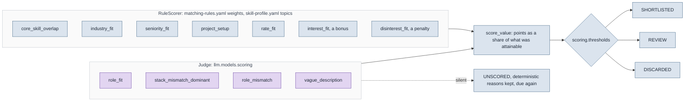

Every reason row names its factor, so the detail screen and `offer_score_reason` say for each
line which half wrote it: the seven in `RuleScorer.DETERMINISTIC` and the four in
`Judge.JUDGED`. The weight table, the prompts as this configuration renders them, and the keys
nothing reads are on the Rules screen and in [WRITING-RULES.md](WRITING-RULES.md).

## 2. The asynchronous side

Three things happen outside the run and outside a request: the batch collector, the package
worker, and the startup sweeps.

### 2a. Batch collection

When scoring submitted a batch, the run closed its `pipeline_run` row as `AWAITING_BATCH` and
left packaging and the digest undone. `ingest/ScoreBatchCollector.poll` runs every five
minutes and does exactly the tail of the run, in the run's own order, once something came
back.

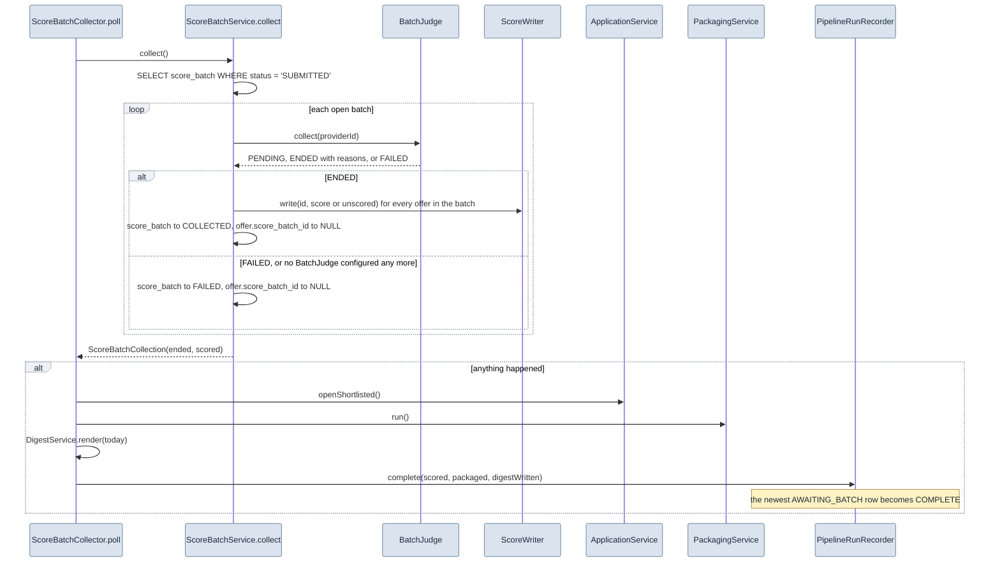

Collecting is deliberately not counted against the day's budget: those answers are already
bought, and a spent budget that refused to collect them would strand every offer in the batch.
Both outcomes clear `offer.score_batch_id`, because an offer must never stay held by a batch
that is finished, whatever the reason it finished. The pointer is what stops the next run from
submitting the same offer twice while its answer is on its way.

### 2b. Package on demand, and its discard twin

Since `V27` a folder is built when a person asks for one, and the asking is a status change.
`ApplicationService.update` publishes `PackageRequested` inside its transaction;
`packaging/PackageWorker` listens `AFTER_COMMIT` and `@Async`, so a rollback cannot leave a
folder behind and the request returns before the templates render. The archive has the mirror
image: `ArchiveService.setArchived` publishes `OffersArchived`, and the same worker discards
the folders of offers that were never sent.

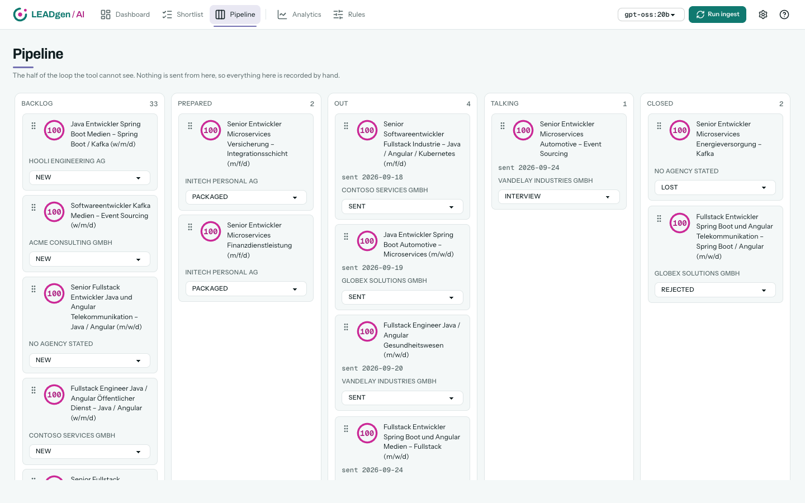

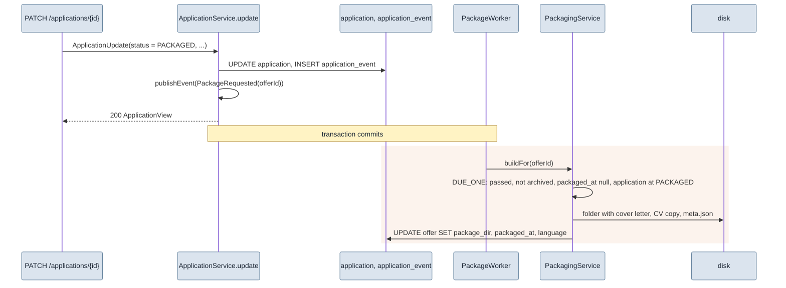

The discard runs the same way from `POST /api/v1/offers/archive` or `PATCH /api/v1/offers/{id}`
with `archived: true`. `PackageArchiveService.discard` deletes the folder and clears the three
package columns for every archived offer that has no application in an *out* state (`SENT`,
`REPLIED`, `INTERVIEW`, `OFFER`) and no event that ever reached one. An application that was
sent keeps its folder, because the document is the record of what went out.

> [!IMPORTANT]
> The age pass publishes nothing. `ArchiveService.run` archives and restores by date every
> night and never touches a folder or an application, because it reconciles: an offer it
> archived tonight comes back the moment the freshness window widens, and a folder deleted
> on the way out would be a button that lies. Only the manual archive discards, and only the
> manual restore resets an application to `NEW`. The reasoning is in
> [decisions/manual-status.md](decisions/manual-status.md).

A folder that ends up referenced by no row, which is what `V27` left behind on the deployed
instance, is collected by `packaging/OrphanSweep` at the next start (§ 2c), never by the
worker.

### 2c. Startup, the watcher, the budget

**Startup.** Six things run once when the context is up, none of them ordered against the
others (no `@Order` anywhere), and none of them fatal:

| Runs on | Class and method | Does |
|---|---|---|
| `ApplicationRunner`, before the ready event | `packaging/OrphanSweep.run` | deletes every folder under `packaging.output_dir` that no `offer.package_dir` names |
| `ApplicationReadyEvent` | `analytics/PipelineRunRecorder.abandonOpenRuns` | closes every `pipeline_run` with `finished_at IS NULL` as `ABANDONED`; a process that died mid-run left it `RUNNING`. A run whose stage threw is already `FAILED` and is not touched |
| `ApplicationReadyEvent` | `manual/ManualInbox.ensure` | creates the `pending/` and inbox directories of the `manual-inbox` source, if one is configured |
| `ApplicationReadyEvent` | `ingest/ScheduledPass.announce` | logs whether a cron is configured and in which timezone it will fire |
| `ApplicationReadyEvent` | `ConfigurationBanner` | logs, per YAML file, which layer won: the classpath default or the file in `leadgen.config-dir` |
| `ApplicationReadyEvent` | `DatasourceBanner` | logs the effective JDBC URL, because the wrong port fails with a message naming the user |

**The watcher.** `config/ConfigWatcher.pollForChanges` runs every two seconds, compares the
four files' modification times with the snapshot they were loaded from, and asks
`ConfigRegistry` to reload when one moved. Snapshots are swapped whole, so a stage that took
`config.snapshot()` at its start runs to its end on one consistent configuration. With
`rules.hot_reload` off the change is logged and applied at the next restart. How the two
layers and the snapshot work is in [decisions/configuration.md](decisions/configuration.md).

**The budget.** One counter per day in `llm_call_budget`, one upsert per request, and every
class that is about to ask a model calls `LlmBudget.take()` first. A request is a request:
an embedding of thirty-two adverts counts the same as one judge's prompt. Collecting a
finished batch is the one exception and is not counted. What a refusal leaves behind, per
caller:

| Caller | Stage or endpoint | One call per | Refused |
|---|---|---|---|
| `ingest/extract/LlmExtractors` | `INGEST`, strategy `llm` | document | the document yields no offers this run |
| `dedupe/OfferEmbedder` | `DEDUPE` | 32 adverts | the rest keep no vector; only `exact_fingerprint` clusters them |
| `content/ContentService` | `CONTENT` | advert with undecided blocks | `content_at` stays null, the advert is due again |
| `fields/FieldsService` | `FIELDS` | advert | the loop breaks; every advert after it stays due |
| `score/ScoringService` | `SCORE`, sync | advert | written unscored with a null `score_model`, due again |
| `score/ScoreBatchService` | `SCORE`, batched | batch | nothing is submitted; every advert stays due |
| `retrieval/RetrievalIndexService` | `RETRIEVAL` | 32 adverts | the rest wait for the next run; the search falls back to its lexical filter |
| `packaging/ProfileEmbeddings` | `PACKAGE` | profile | the letter ranks reference projects lexically only |
| `score/ScoringService.rescore` | `POST /offers/{id}/score` | advert | 409 with a sentence, because somebody pressed a button |
| `ask/AdvertAskService` | `POST /offers/{id}/ask` | question | 409 `CannotAsk` |

The reasoning, and why a refusal never falls back to another provider, is in
[decisions/pipeline-scoring.md](decisions/pipeline-scoring.md) and in the root `CLAUDE.md`.

## 3. API write paths

Ten endpoints write, or start something that writes. Every one is a single controller method
calling a single service method, and every write is one transaction. Reads are the other
side of the house and are described in [decisions/read-side.md](decisions/read-side.md).

| Endpoint | Controller → service | Writes | Event | Errors |
|---|---|---|---|---|
| `POST /api/v1/ingest?model=` | `IngestController.run` → `IngestService.run` | the whole of § 1 | | 409 `AlreadyRunning`, 400 `Judges.UnknownModel`, 500 `StageFailed` naming the stage |
| `POST /api/v1/offers/{id}/score?model=` | `OfferController.rescore` → `ScoringService.rescore` | the five score columns and the reasons of one offer, without the staleness guard | | 409 `NotOnTheShortlist` or `NoJudge`, 400 `UnknownModel`, 404 |
| `POST /api/v1/offers/{id}/fetch` | `OfferController.refetch` → `enrich/OfferRefetch.refetch` | the enrichment columns of one offer past its cached failure, `fetched_page` for its URL; once text is stored, `content_at` and `fields_at` reset and content, fields and score run for that id alone | | 404; 409 `NotFetchable` (not a passed, unarchived offer with a URL and no text); 429 `NoPermit` (the shared window is spent, nothing written). A page that refused again is a 200 with the new `enrichment_note` |
| `POST /api/v1/offers/{id}/ask?question=` | `OfferController.ask` → `ask/AdvertAskService.ask` | nothing; reads `content_blocks` and `full_text`, spends one budget call | | 409 `CannotAsk` when no model, no text, or no budget |
| `PATCH /api/v1/offers/{id}` `{archived}` | `OfferController.patch` → `ArchiveService.setArchived(id, flag)` | `archived_at`, `archive_source` (`MANUAL` or `RESTORED`); on restore, the application back to `NEW` with an event | `OffersArchived` on archive | 404 |
| `POST /api/v1/offers/archive` `{ids}` | `OfferController.archiveAll` → `setArchived(ids, true)` | the same, for up to `ArchiveRequest.MAX_IDS` (500) distinct offers | `OffersArchived` | 400 on validation |
| `PATCH /api/v1/applications/{id}` | `ApplicationController.update` → `ApplicationService.update` | `application`; `application_event` when the status changed | `PackageRequested` on a move to `PACKAGED` | 404 `ApplicationNotFound`, 409 `TransitionRefused` |
| `POST /api/v1/sources/manual/documents` (multipart `file`) | `ManualSourceController.upload` → `manual/ManualUploadService.store` | a file in the inbox's `pending/` directory; no table | | 201; 400 `ManualDocumentName.Rejected`, 409 `NoInbox` |
| `POST /api/v1/sources/manual/pending/{name}/confirm` | `confirm` → `ManualUploadService.confirm` | rewrites the file with the reviewed fields as front matter and moves it into the `manual-inbox` source's path; no table | | 404, 409 `NoInbox` |
| `DELETE /api/v1/sources/manual/pending/{name}` | `reject` → `ManualUploadService.reject` | deletes the file | | 204; 404 |
| `GET /api/v1/offers/{id}/package` | `PackageController.download` → `PackageArchiveService.folderFor` | nothing; streams the folder as a zip | | 404 `NoPackage` |

There is no `@ControllerAdvice`: each controller maps its own exceptions with
`@ExceptionHandler` and `@ResponseStatus`, so the status a service error becomes is decided
next to the endpoint that can raise it.

Two of the ten are not a straight line. The application update has rules about dates, and the
manual confirm writes no table at all.

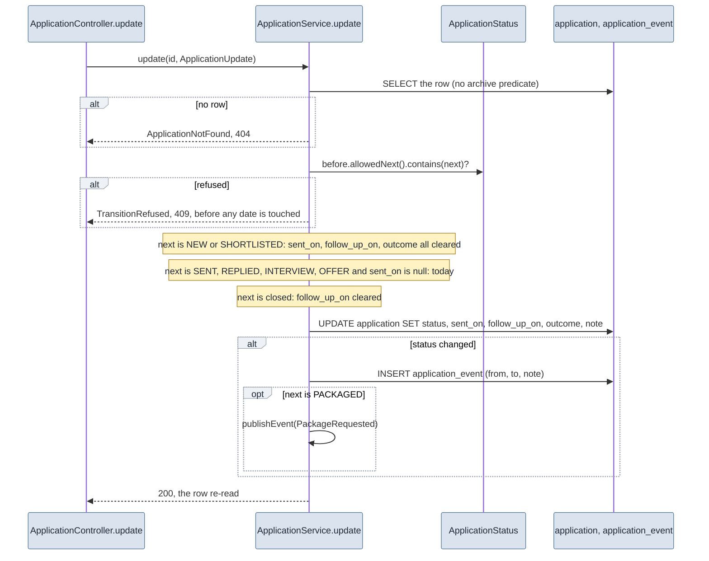

`GET /api/v1/applications/transitions` serves `allowedNext()` for all eleven states, and the
board greys out what it names, so the browser never carries a second copy of the rule.

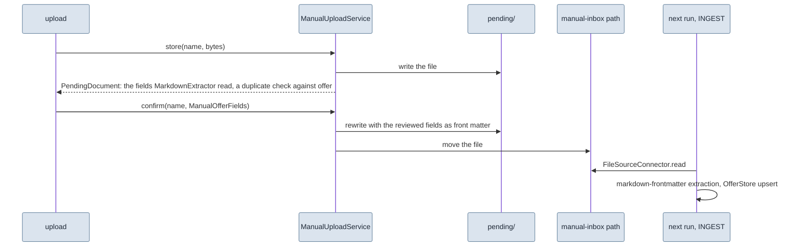

The file is the state: nothing is written to a table until the next run reads the inbox, and
a rejected upload is a file that was deleted rather than a row nobody will look at again. The
review in front of it is in [decisions/pipeline-ingest.md](decisions/pipeline-ingest.md).

## 4. State machines

Four columns hold a state that moves. Three of them are moved by code alone; the fourth,
`application.status`, is moved by a person, and the only rule the code enforces is the one
that keeps "PACKAGED" and "there is a folder" the same fact.

### `application.status`

Eleven states in five lanes. From the two states before a package the choice is the other
one, `PACKAGED`, or the two ways of deciding against an offer without preparing it; from every
other state the choice is all eleven, because a hand-entered mistake must be correctable in
any direction. `ApplicationStatus.allowedNext()` is the rule, `ApplicationService.update`
enforces it with a 409, and `GET /applications/transitions` serves it.

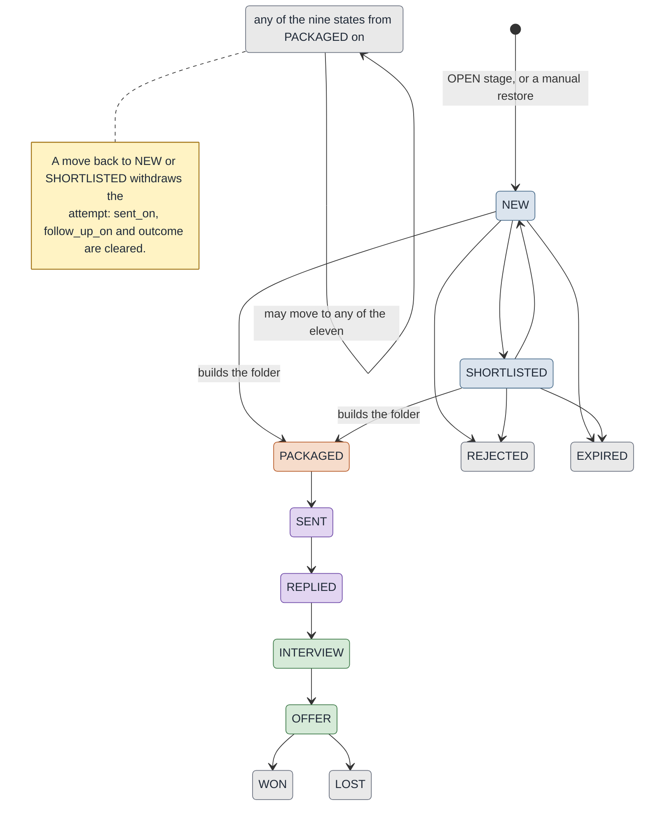

The drawn edges from `PACKAGED` onwards are the usual path, not the rule: those nine states
answer "all eleven". Three writers move the column. `openShortlisted` inserts at `NEW` and is
idempotent, so a second run never resets a status somebody moved. `update` is the operator.
And `ArchiveService.setArchived(ids, false)`, the manual restore, resets any row not already
at `NEW` back to `NEW` with a `restored` event, because the folder was thrown away on the way
into the archive unless the application had been sent.

### `pipeline_run.status`

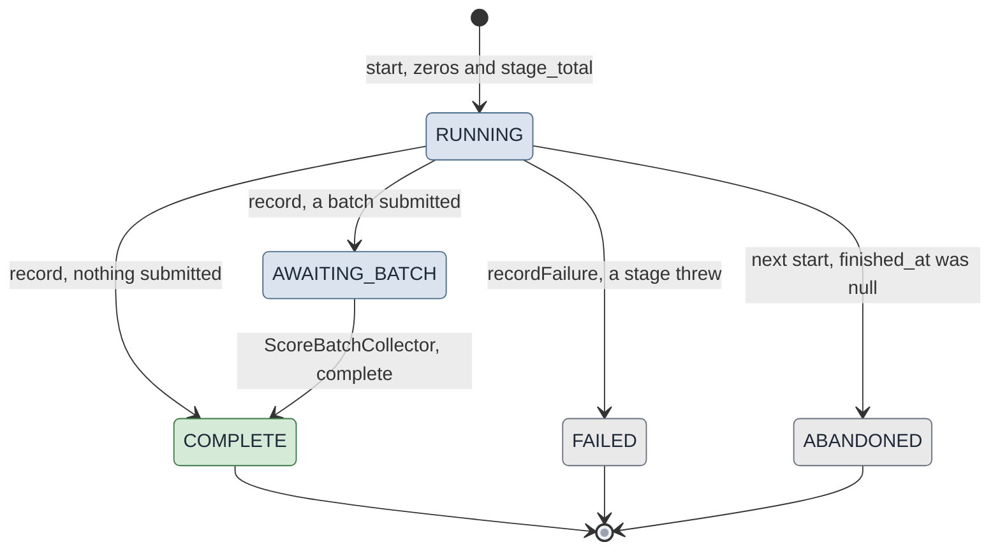

`record` stamps `finished_at` on an `AWAITING_BATCH` row too, and `complete` moves it forward
again; that is why the reporting query bounds a run's source rows by the next run's
`started_at` rather than by this column. A run whose stage threw closes as `FAILED` with its
counts up to that stage and all its timings, and the "last run" reader includes it, because
those counts are real and the stage table says where it stopped. It excludes `ABANDONED`,
because that row carries zeros and would claim a pass that found nothing. A batch submitted
before a later stage threw is still collected and its offers scored; only the `FAILED` row
does not move, because `complete` looks for `AWAITING_BATCH`.

### `score_batch.status`

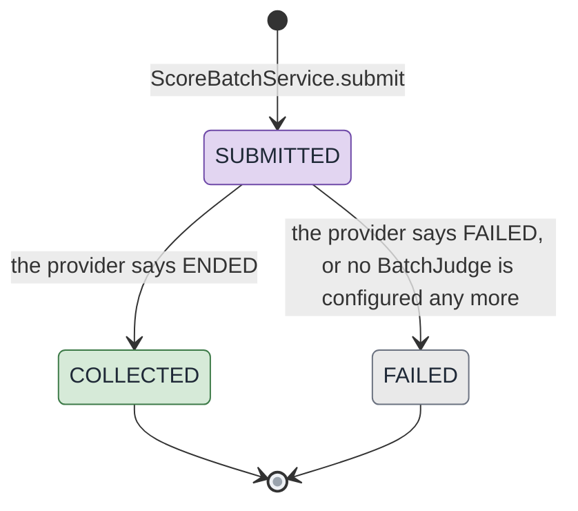

Both terminal moves clear `offer.score_batch_id` on every offer of the batch, so a failed
batch's offers are due again on the next run and a collected batch's offers are either scored
or, for an entry that came back without a usable judgement, written unscored and due again.

### The offer's verdict and its archive axis

`offer.status` is not a lifecycle so much as a verdict that is re-taken every run: the filter
reads every row and writes `PASSED` or `FILTERED_OUT` onto every row, and a rule change moves
offers both ways on the next pass. `INGESTED` is only the value a row has between its insert
and the first filter after it. The archive is a second axis on purpose, because a value in
`status` would be overwritten by the next verdict.

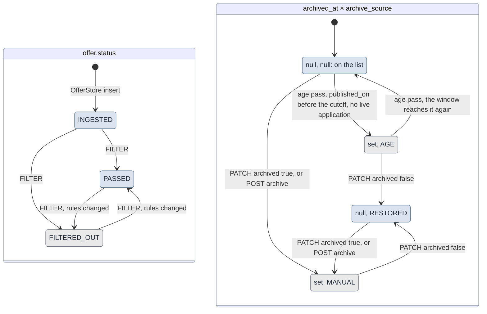

The fourth row of the axis is the reason for the second column: the age pass never touches a
row whose `archive_source` is set, so an offer a person restored is not archived again the
next night, and an offer a person archived does not come back when the window widens. The
working list is the conjunction of both axes with the duplicate pointer:
`status = 'PASSED' AND duplicate_of_id IS NULL AND archived_at IS NULL`, and § 3 of
[DATA-MODEL.md](DATA-MODEL.md) lists where it is applied.

`FilterStage` is an ordered enum and not a state machine: an offer stops at the first stage
that rejects it, and the six stages with what each reads are in
[WRITING-RULES.md](WRITING-RULES.md).
