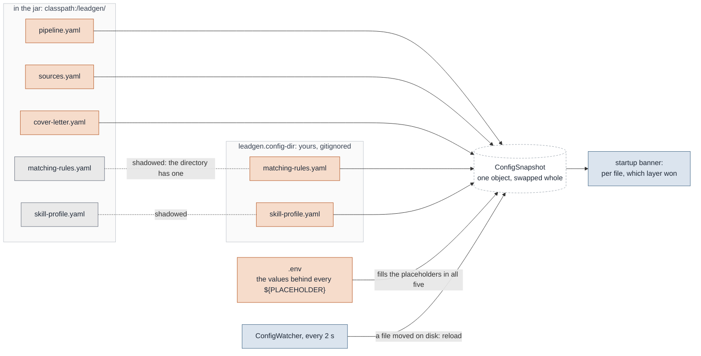

# Configuration

Nothing individual is baked into the artifact, and nothing individual is committed. This
document says where every value comes from and what happens when it is missing.

## Two layers, and only two

Working defaults ship on the classpath under `backend/src/main/resources/leadgen/` and are
part of the jar. The directory named by `leadgen.config-dir` overrides them **file by
file** — put one file there and the other four still come from the jar.

That is the same shape Spring's own configuration has, and it buys two things: the tool
runs on a fresh clone with no configuration at all, and a value belonging to one person is
never baked into an image. The startup banner names, per setting, which layer decided it.

The classpath directory is `/leadgen/` and deliberately **not** `/config/`: Spring scans
`classpath:/config/` for its own configuration by default, so a file placed there would be
read twice — once by this loader and once by Spring, which would quietly bind whatever
happened to match.

```
backend/src/main/resources/leadgen/    the defaults, in the jar — every value a ${PLACEHOLDER}
  pipeline.yaml
  matching-rules.yaml
  sources.yaml
  skill-profile.yaml
  cover-letter.yaml
  templates/

config/                                yours, gitignored, overriding the above file by file
.env                                    the values behind the placeholders, gitignored
```

With two of the five files overridden, the resolution looks like this. A file in the
directory shadows the whole shipped file of the same name; the three that are not there come
from the jar; `.env` fills the placeholders in whichever five were chosen; and the result is
one snapshot the watcher swaps whole.



## The five files

| File                  | Bound to         | What it decides                                                                                                                                                               |
|-----------------------|------------------|-------------------------------------------------------------------------------------------------------------------------------------------------------------------------------|
| `sources.yaml`        | `SourcesConfig`  | Where offers come from and how a document is read, down to the CSS selector and the date format. A new source is a block here — see [ADDING-A-SOURCE.md](ADDING-A-SOURCE.md). |
| `matching-rules.yaml` | `MatchingRules`  | The six knockout stages, the scoring weights and penalties, the three thresholds, deduplication, freshness, follow-up — see [WRITING-RULES.md](WRITING-RULES.md).             |
| `skill-profile.yaml`  | `SkillProfile`   | Who is applying: skills with weights and aliases, industries, reference projects, topics, CVs.                                                    |
| `pipeline.yaml`       | `PipelineConfig` | The process itself: provider and model, enrichment, content segmentation, packaging, digest, auth.                                                                            |
| `cover-letter.yaml`   | `CoverLetterStyle` | How a model-written cover letter may read, per language: banned phrases, a word limit, structure notes, and example letters the model takes its tone from. The shipped file has rules and no example; yours carries the letters. It has no path key in `pipeline.yaml`. |

**`pipeline.yaml` is not `application.yaml`.** The latter is Spring's and only Spring's: it
wires the *process* — datasource, ports, where the configuration directory is. The two used
to share a name, which meant a stack trace naming it could mean either file.

### The rules that make them predictable

- **`llm.budget.max_calls_per_day` is a number in `pipeline.yaml` and not an environment variable**, like every other
  tuning value: `.env` holds what is individual, the file holds what is decided. Every request that leaves for a model
  counts once, whatever it carries — a judge's prompt, a classifier's, a field extraction, a document with no
  frontmatter, and an embedding of thirty-two adverts alike. Collecting an already-submitted batch does not count,
  because those answers are paid for and refusing to fetch them would strand them. When the day is spent each stage
  stops asking and leaves its work due, so the next run continues where this one stopped and nothing is written as
  answered that was not. **`0` means no calls at all; no ceiling is the `budget:` block being absent**, which is the
  safer way round: somebody writing `0` to mean "off" gets a run that stops and says so, rather than a bill.

- **`content.rules` are an optimisation, not a mechanism, and every pattern is anchored or specific on purpose.** They
  label a block of a fetched advert for free, before anything is asked of a model; a rule that stops matching costs the
  shortcut and nothing else, because the block then falls through to the digest cache and then to the model. A *loose*
  pattern is the one thing that does damage: it does not produce a wrong label, it hides a paragraph of somebody's
  advert, and a bare `datenschutz` would delete exactly the offers a data-protection contractor is looking for. Regexes
  need **single quotes** in YAML — a double-quoted scalar allows only a fixed set of escapes, `\-` is not among them,
  and the file then fails to parse with nothing pointing at the pattern.
- **The five files are one snapshot**, read together and swapped atomically, which is why
  `rules.hot_reload` is one switch for all of them. Reloading one without the others would
  hand the pipeline a picture that never existed on disk. The profile joined the watch list
  with the topic lists; a change to it re-totals the scored offers on the next run without a
  model call, which is described in `docs/WRITING-RULES.md`.
- **`retrieval.topic_floor` is a similarity, so it is measured before it is set.** Unset, the
  shortlist's topic filter reads the stored alias matches alone. Set, it also returns adverts
  whose retrieval vector lies within that cosine of the topic's name. It widens that one filter
  and nothing else; `docs/samples/measure_topic_floor.ts` turns a labelled sample into the number.
- **Binding is strict.** An unknown property fails the file. A misspelled
  `min_remote_percent` would otherwise disable a hard filter in silence, and the only
  visible effect is a longer shortlist — which looks exactly like a good day on the market.
- **Invalid at startup is fatal; invalid at reload is not.** Running with a filter nobody
  wrote is worse than not running. But a half-saved file must not take a running tool down,
  so the last good snapshot stays and the problem is logged.
- **A path in these files names a file, never a location.** Only the file name is used, and
  the two-layer lookup decides where it comes from. Anything more forgiving was measured
  and removed: resolving `config/local/matching-rules.yaml` upwards from the working
  directory made a run read a file from *outside* the directory it was pointed at, and look
  entirely normal doing it.
- **Change detection polls timestamps.** For five files the efficiency argument is worth
  nothing, and `WatchService` is native only on Linux — on macOS the JDK falls back to
  polling with a ten-second default latency anyway. A change is applied one cycle after it
  is first seen, so a save in progress finishes first.

## Placeholders and `.env`

Every value in the shipped files is a `${PLACEHOLDER}`. `${VAR}` with no value becomes the
empty string, and an empty YAML scalar is **null**, not `""` — every consumer treats both
alike. Whether empty is acceptable is a question about the field, so validation answers it:
an unset LLM key is fine, an unset IMAP host on an *enabled* source is not.

`.env` is read by the application, not by the build. It is searched upwards from the working
directory, and real environment variables win — so `bootRun` (which runs in `backend/`), an
IDE run configuration (repository root) and a jar all behave identically. It also reaches
Spring, registered directly below `systemEnvironment`, which is why `LEADGEN_CONFIG_DIR`,
`POSTGRES_PASSWORD` and `SERVER_PORT` can be written there and have an effect.

**The file has to be called `.env`.** Compose substitutes the `${...}` in
`docker-compose.yml` from `.env` and from nothing else — not from `env_file:`, which only
injects into a container, and not from `COMPOSE_ENV_FILES` set inside a file. Another name
needs a flag on every call, and forgetting it silently applies the compose defaults, so the
stack listens where the application is not looking.

## Every variable

Start from [`.env.example`](../.env.example), which carries the same list with its
rationale. `*` marks a credential.

### Mail access

| Key | Default | Note |
|---|---|---|
| `IMAP_HOST` | — | Required on an *enabled* imap source, ignored otherwise. |
| `IMAP_PORT` | `993` | |
| `IMAP_USER` | — | |
| `IMAP_PASSWORD` * | — | |
| `NEWSLETTER_FOLDER`, `NEWSLETTER_FROM`, `NEWSLETTER_SUBJECT`, `NEWSLETTER_BLOCK_SELECTOR` | — | Consumed by a `sources.yaml` you write in `config/`, not by the shipped one. |

### Language model

| Key                         | Default | Note                                                                                                                                                                                                                                                                                                                                                                                                                      |
|-----------------------------|---------|---------------------------------------------------------------------------------------------------------------------------------------------------------------------------------------------------------------------------------------------------------------------------------------------------------------------------------------------------------------------------------------------------------------------------|
| `LLM_PROVIDER`              | —       | `anthropic`, `ollama` or `openai-compatible`. A kind, never a vendor: it names a wire format and the base URL decides who answers. Anything else is refused loudly.                                                                                                                                                                                                                                                       |
| `LLM_BASE_URL`              | —       | Required even for a hosted provider whose address never changes. A URL in the code is a vendor in the code.                                                                                                                                                                                                                                                                                                               |
| `LLM_API_KEY` *             | —       | Optional in full. Without it the tool runs and loses the score total and the cover letter; the deterministic reasons are still written. `ollama` needs none.                                                                                                                                                                                                                                                              |
| `LLM_BATCH`                 | `false` | Half the price, answers minutes later. Only the Messages API batch is implemented; `true` on any other provider is fatal at load rather than quietly synchronous at full price.                                                                                                                                                                                                                                           |
| `LLM_MODEL_SCORING`         | —       | The judge, and the default of the list below. **Read by three stages**: the scoring judge, the content classifier and the field extractor, plus the extraction fallback whenever `LLM_MODEL_EXTRACTION` is empty. One key rather than a second `models.content`, because they ask a bounded question and answer in a few lines of JSON — and a `models.*` key nothing reads is the kind of lie this file exists to avoid. |
| `LLM_MODEL_SCORING_OPTIONS` | —       | Comma separated. An **allowlist**, checked before the run starts: the chosen model travels as a request parameter to an endpoint billed per token. It governs the judge alone — which classifier reads an advert is not a parameter of the run, because two judges are two scales and comparing them is the point, while a label is a fact about a paragraph and there is nothing to compare.                             |
| `LLM_MODEL_EXTRACTION`      | —       | Read by the extraction fallback: a source with `fallback: llm` hands it a document the deterministic rules could not read. Empty falls back to `LLM_MODEL_SCORING`, and the startup log says which was taken.                                                                                                                                                                                                             |
| `LLM_MODEL_EMBEDDING`       | —       | Read by deduplication's two similarity strategies. **No fallback**: a chat model is not an embedding model, so unset means only `exact_fingerprint` runs. Must return at least 2000-dimensional vectors, the width of the `offer.embedding` column and the widest pgvector will index; a wider model is truncated to the leading 2000.                                                                                                                                                                          |
| `LLM_MODEL_WRITING`         | —       | Drafts the cover letter when an application moves to PACKAGED. The draft is checked against the profile and `cover-letter.yaml` before it is written; unset, failed or rejected, the Freemarker template writes the letter. **No fallback** to `LLM_MODEL_SCORING`. |

### Database

| Key | Default | Note |
|---|---|---|
| `POSTGRES_HOST` | `localhost` | |
| `POSTGRES_PORT` | `55432` | Not 5432, on purpose — see [DEVELOPMENT.md](DEVELOPMENT.md). Inside the container the port is always 5432. |
| `POSTGRES_DB` | `leadgen` | |
| `POSTGRES_USER` | `leadgen` | |
| `POSTGRES_PASSWORD` * | `leadgen` under Compose | The compose default exists so the stack starts; set it. |

### Paths

| Key | Default | Note |
|---|---|---|
| `LEADGEN_CONFIG_DIR` | `./config` | Relative is searched upwards from the working directory. `/config` in the container. |
| `PACKAGES_DIR` | `./packages` | Where an application folder is written. |
| `DIGEST_DIR` | `./packages/digest` | Its **own** setting; it does not follow `PACKAGES_DIR`. Left unset in a container it resolves against the working directory, which the non-root user cannot write — the run then completes every stage and dies on the last. |
| `INBOX_DIR` | `./data/inbox` | Where the `local-eml` replay source reads from. |
| `MANUAL_INBOX_DIR` | `inbox` **inside the config directory** | Where an upload lands. Under Compose it must be named, or it resolves inside the read-only `/config` mount and every upload fails. |
| `PROFILE_PATH`, `RULES_PATH` | `skill-profile.yaml`, `matching-rules.yaml` | File names, resolved against the config directory. |

### Process

| Key | Default | Note |
|---|---|---|
| `SERVER_PORT` | `8080` | |
| `SERVER_ADDRESS` | `127.0.0.1` | The only thing in front of the write endpoints while `AUTH_MODE` is `none`. Compose sets `0.0.0.0`. |
| `AUTH_MODE` | `none` | The only implemented value; any other is fatal at load. |
| `LOG_LEVEL` | `INFO` | |
| `CONFIG_POLL_INTERVAL` | `PT2S` | Two polls are needed to apply a change, so worst case is twice this. |
| `SCORE_BATCH_POLL_INTERVAL` | `PT5M` | Only read when `LLM_BATCH` is true. |
| `AUTH_MODE` | `none` | `none` or `oidc`. Under `oidc`, `OIDC_ISSUER` is required and every request carries a bearer token. Read once at startup, so a change takes a restart. |
| `OIDC_ISSUER` | — | The realm's issuer URL, the one whose `/.well-known/openid-configuration` answers. Fetched at startup, so an unreachable issuer stops the application rather than starting it unprotected. |
| `OIDC_CLIENT_ID` | — | Optional. Set it and a token must also name it in `aud`, which on Keycloak needs an audience mapper on the client. Empty means issuer and signature only. |
| `INGEST_CRON` | `-` | A Spring cron expression, in the JVM's timezone, for a pass the tool starts itself. `-` is no schedule, and it is the default. Leave it alone if a CronJob or the host's cron already schedules the run. |
| `DIGEST_FORMAT` | `html` | `text` or `html`. |
| `OIDC_ISSUER`, `OIDC_CLIENT_ID` | — | Read only when `AUTH_MODE` is `oidc`, which is not implemented. |
| `SAMPLE_FEED_URL` | — | The feed of `sample-portal-feed`, which ships disabled. |

### Compose and the dev server only

| Key | Default | Note |
|---|---|---|
| `WEB_PORT` | `4200` | The host port the web container publishes. |
| `API_PROXY_TARGET` | `http://localhost:8080` | Where `bun run start` proxies `/api`. The dev server prints the effective value on startup. |

These two belong to the tooling, not the application, which is why the startup banner leaves
them out — showing them would invite you to change one and wait for an effect that cannot
come.

## Reading a running instance

The backend prints one box on `ApplicationReadyEvent`: every app-relevant setting, its
effective value, and which layer decided it (`env` before `.env` before `yaml`). It is
cumulative rather than per file, because nobody debugging a run thinks in files — they think
"which database, which mailbox, which model".

Secrets are masked by **key name**, because a password is not recognisable by looking at it;
the only safe direction to be wrong in is masking something harmless. The mask is a fixed
width — stars matching the length would publish the length — and masked, empty and unset are
three different renderings, because whether a secret is configured at all is the one thing
about it worth logging. Credentials inside a URL are masked too.

Note that `docker compose config` resolves and prints every value in clear, including keys.
That is Compose, not this tool.
