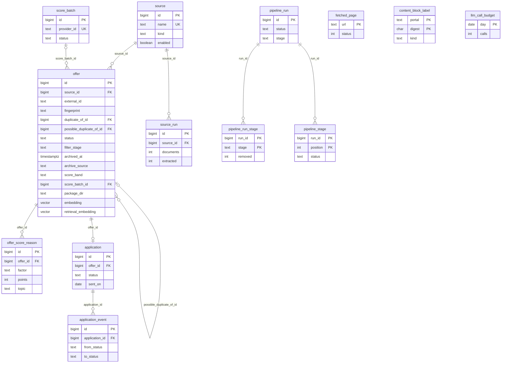

# Data model

The thirteen tables, how they point at each other, and which class writes and reads each one.
This is the schema as Flyway builds it, read straight out of
`backend/src/main/resources/db/migration/`, and it is the document to open when the question
is *where does this value live* or *who is allowed to change it*. The reasoning behind a
column belongs to the decision records; each section links the one that carries it.

> [!NOTE]
> Derived from `V1` to `V29`. When this document and a migration disagree, the migration wins,
> and the fix is here. There is no ORM: every write is a plain SQL statement in the service
> that owns it, so "who writes this" has one answer per column and it is worth writing down.

The pipeline itself, stage by stage, is in [ARCHITECTURE.md](ARCHITECTURE.md); what each stage
does to these tables, in order, is in [BACKEND-FLOWS.md](BACKEND-FLOWS.md).

## 1. The shape in one picture

One table carries the product. `offer` is one row per advert as it was extracted, and every
stage of the pipeline owns a slice of its columns. Six tables hang off it or off each other;
three more stand alone, keyed by something other than a row id.



How to read it: the diagram shows keys, foreign keys and the columns that hold a state. It
leaves out the forty-odd columns of `offer` that carry the advert itself; those are grouped by
owner in § 3. Two things are easy to miss. `offer` points at itself twice, and the two pointers
mean different things: `duplicate_of_id` hides a row from the working list, while
`possible_duplicate_of_id` only flags it for a person. And `application.offer_id` is unique, so
an offer has at most one application, ever.

Every foreign key from a child table cascades on delete, except the three on `offer` itself
(`source_id` and the two self-references) and `offer.score_batch_id`, which are plain
references. In practice nothing deletes an offer: no `DELETE FROM offer` exists in the
application, so the cascades on `offer_score_reason` and `application` are there for an
operator's SQL, not for the code.

## 2. Three tables no key points at

Three tables are keyed by a value rather than by a row id, and nothing references them. Each
is a cache or a counter that would work exactly the same if it were emptied.

**`fetched_page`** (`V5`) is the enrichment fetch cache, keyed by `url`. One row per address
the tool has fetched, holding the HTTP `status`, the `body` and `fetched_at`. Written and read
only by `enrich/PageCache`, which upserts on the URL. In the database rather than on disk
because the container has no scratch volume, and a cache that does not survive a restart turns
a rate limit into a promise nobody keeps. The reasoning is in
[decisions/pipeline-enrich-content.md](decisions/pipeline-enrich-content.md).

**`content_block_label`** (`V17`) remembers what a paragraph of a fetched advert means, keyed
by `(portal, digest)`, so the same block of a portal's furniture is decided once and is free
for every advert that repeats it. `kind` is a `ContentKind` name, `decided_by` a `Decider`
name, `model` records who answered when a model did, and `sample` keeps the first 200
characters so a row can be read and argued with by hand. `times_seen` counts the repeats.
Written and read only by `content/BlockLabelStore`. Deliberately not keyed by the model: a
label is a fact about a paragraph, a score is a scale. Reasoning in the same decision record.

**`llm_call_budget`** (`V24`) is one row per calendar day with a `calls` counter. Every stage
that is about to send a request to a model calls `llm/LlmBudget.take()`, which is one upsert
guarded by `calls < :limit`; no row back means the day's allowance is spent and the stage
leaves its work due. It lives in the database so that a restart does not hand the ceiling out
twice, and so the nightly run and a run started by hand share one day. Reasoning in
[decisions/pipeline-scoring.md](decisions/pipeline-scoring.md).

## 3. `offer`: one row, twelve owners

`offer` has grown from fourteen columns in `V1` to fifty-eight in `V29`, and it has grown by
owner: each pipeline stage added the columns it writes and no other stage touches them. The
table below is the map. "Written by" is the class whose `UPDATE offer SET …` names the column;
"read by" lists the main consumers and is not exhaustive, because the read side
(`offer/OfferQueryService`) reads all of it.

| Group | Columns | Since | Written by | Read by |
|---|---|---|---|---|
| Identity | `source_id`, `external_id`, `title`, `description`, `url`, `location`, `portal`, `agency`, `published_on`, `fingerprint`, `tags`, `received_at`, `ingested_at` | `V1`, `V2`, `V12` | `ingest/store/OfferStore`, one upsert on `(source_id, external_id)` | everything |
| Duplicates | `duplicate_of_id`, `possible_duplicate_of_id`, `embedding`, `embedding_model` | `V1`, `V23`, `V25` | `dedupe/DeduplicationService` (by fingerprint), `dedupe/SimilarOffers` (by vector), `dedupe/OfferEmbedder` (the vector) | every working-set predicate; `OfferQueryService` for the cluster and the flag |
| Filter verdict | `status`, `filter_stage`, `filter_reason` | `V1`, `V4` | `filter/FilterService`, every row on every run | every working-set predicate; the funnel in `analytics/AnalyticsQueryService` |
| Archive axis | `archived_at`, `archive_source` | `V13` | `archive/ArchiveService`: the age pass and the manual archive and restore | every working-set predicate; `OfferView` |
| Enrichment | `rate_eur`, `duration`, `workload`, `remote_percent`, `starts_on`, `contact`, `full_text`, `enriched_at`, `enrichment_note` | `V5` | `enrich/EnrichmentService` | `content/ContentService` (`full_text`), `score/ScoringService`, `packaging/PackagingService`, `digest/DigestService` |
| Content | `content_blocks`, `content_at`, `content_model`, `content_undecided` | `V17` | `content/ContentService`, which also nulls `score_model` when the blocks changed | `ScoringService`, `retrieval/RetrievalIndexService`, `OfferQueryService` |
| Fields | `start_text`, `starts_on`, `duration`, `duration_months`, `apply_by`, `apply_by_text`, `fields_at`, `fields_model` | `V5`, `V18` | `fields/FieldsService`, which also nulls `score_model` when a value moved | `ScoringService`, the three sort keys in `OfferQueryService` |
| Score | `score_value`, `score_band`, `score_model`, `ruleset_version`, `scored_at`, `score_batch_id`, `profile_digest` | `V6`, `V10`, `V28` | `score/ScoreWriter` (the five score columns), `score/ScoreBatchService` (`score_batch_id`), `ScoringService` (`profile_digest`) | `OfferQueryService`, `DigestService`, `application/ApplicationService` (`score_band`), `PackagingService`, `analytics/PipelineRunRecorder` |
| Retrieval | `retrieval_embedding`, `retrieval_embedding_model`, `retrieval_embedded_at` | `V26` | `retrieval/RetrievalIndexService` | `retrieval/SemanticFilter` |
| Package | `package_dir`, `packaged_at`, `language`, `cover_letter_text`, `cover_letter_author`, `cover_letter_at` | `V7`, `V29` | `packaging/PackagingService` (sets all six in the build's one transaction; the letter's three after its file), `packaging/PackageArchiveService` (clears all six in one `UPDATE`), `packaging/CoverLetterService` (the three letter columns on a redraft, author `model` or `template`); a person's save of the letter (`PUT /api/v1/offers/{id}/cover-letter`, `packaging/CoverLetterService`) writes the three letter columns with author `edited` | `OfferQueryService`, `ApplicationService`, `packaging/OrphanSweep` |

Two groups share a column. `starts_on` and `duration` were created for enrichment in `V5` and
are reused by the fields stage in `V18`, which is why they appear twice; after the fields stage
has run, `duration` holds the advert's own phrase and `duration_months` the number. And
`score_model` is written by three stages: the scorer sets it, and content and fields null it
when what they wrote would change the judge's answer, which is what makes the offer due for
scoring again.

<details>
<summary>Every column of <code>offer</code>, in the order the migrations added it (55 columns)</summary>

| Column | Type | Since | Meaning |
|---|---|---|---|
| `id` | `bigint` | `V1` | identity, generated |
| `source_id` | `bigint` | `V1` | → `source.id` |
| `external_id` | `text` | `V1` | the portal's own id; with `source_id` the upsert key, where not null |
| `title` | `text` | `V1` | as extracted, after `TitleNormalizer` |
| `description` | `text` | `V1` | the teaser the newsletter carried |
| `url` | `text` | `V1` | the advert's address, unwrapped from any proxy link |
| `location` | `text` | `V1` | |
| `portal` | `text` | `V1` | which site the advert was on |
| `agency` | `text` | `V1` | |
| `published_on` | `date` | `V1` | what the advert says about itself |
| `fingerprint` | `text` | `V1` | normalised title plus portal; the dedupe key |
| `duplicate_of_id` | `bigint` | `V1` | → `offer.id`; set means "hidden behind that primary" |
| `status` | `text` | `V1` | the filter verdict, see § 5 |
| `ingested_at` | `timestamptz` | `V1` | when this application wrote the row |
| `tags` | `text[]` | `V2` | the aggregator's search tags |
| `filter_stage` | `text` | `V4` | the `FilterStage` that rejected it, else null |
| `filter_reason` | `text` | `V4` | the sentence behind that stage |
| `rate_eur` | `numeric(8,2)` | `V5` | |
| `duration` | `text` | `V5` | the advert's phrase, since `V18` |
| `workload` | `text` | `V5` | |
| `remote_percent` | `integer` | `V5` | |
| `starts_on` | `date` | `V5` | resolved by the fields stage since `V18` |
| `contact` | `text` | `V5` | |
| `full_text` | `text` | `V5` | the fetched advert, never edited in place |
| `enriched_at` | `timestamptz` | `V5` | set with a null `enrichment_note` means complete |
| `enrichment_note` | `text` | `V5` | why the fetch left the row incomplete |
| `score_value` | `integer` | `V6` | null when no model judged it |
| `score_band` | `text` | `V6` | see § 5 |
| `score_model` | `text` | `V6` | who judged; null makes the row due |
| `ruleset_version` | `text` | `V6` | the weights the score was computed under |
| `scored_at` | `timestamptz` | `V6` | |
| `package_dir` | `text` | `V7` | where the folder was written; null means none |
| `packaged_at` | `timestamptz` | `V7` | |
| `language` | `text` | `V7` | decided when the package is built |
| `score_batch_id` | `bigint` | `V10` | → `score_batch.id` while an answer is in flight |
| `received_at` | `timestamptz` | `V12` | when the mail arrived; null for a file |
| `archived_at` | `timestamptz` | `V13` | |
| `archive_source` | `text` | `V13` | `AGE`, `MANUAL` or `RESTORED`, see § 5 |
| `content_blocks` | `jsonb` | `V17` | a list of `ContentBlock` |
| `content_at` | `timestamptz` | `V17` | |
| `content_model` | `text` | `V17` | |
| `content_undecided` | `integer` | `V17` | blocks the classifier left open |
| `start_text` | `text` | `V18` | the advert's phrase for the start |
| `duration_months` | `integer` | `V18` | |
| `apply_by` | `date` | `V18` | |
| `apply_by_text` | `text` | `V18` | |
| `fields_at` | `timestamptz` | `V18` | |
| `fields_model` | `text` | `V18` | |
| `possible_duplicate_of_id` | `bigint` | `V23` | → `offer.id`; a flag, never a merge |
| `embedding` | `vector(2000)` | `V25` | title, location and the opening of the teaser |
| `embedding_model` | `text` | `V25` | |
| `retrieval_embedding` | `vector(2000)` | `V26` | the whole de-furnitured advert |
| `retrieval_embedding_model` | `text` | `V26` | |
| `retrieval_embedded_at` | `timestamptz` | `V26` | |
| `profile_digest` | `text` | `V28` | SHA-256 of the profile the deterministic reasons were computed against |
| `cover_letter_text` | `text` | `V29` | the package's letter as written to `cover_letter.txt`; null without a package or for one built before `V29` |
| `cover_letter_author` | `text` | `V29` | `model`, `template` or `edited` (checked); the build writes the first two, a save the third |
| `cover_letter_at` | `timestamptz` | `V29` | when the letter was last written: `packaged_at` on a build, `now()` on a save or a redraft, and unchanged when a rebuild carries an edited letter |

`V22` first added `embedding` at 768 dimensions; `V25` dropped and re-created it at 2000, so
both vector columns are the same width. Why 2000 and not 4096 is in
[decisions/retrieval.md](decisions/retrieval.md).

</details>

### The working set

Three conditions together mean "this offer is on my list today":

```sql
status = 'PASSED' AND duplicate_of_id IS NULL AND archived_at IS NULL
```

The predicate is written out at every site that counts survivors rather than kept in one
place, so the sites are worth listing. `FieldsService`, `ScoringService`, `PackagingService`,
`RetrievalIndexService`, `SemanticFilter`, `DigestService` and
`ApplicationService.openShortlisted` apply all three. Two stages apply only two: `EnrichmentService` and `ContentService` read
`status = 'PASSED' AND archived_at IS NULL` without the duplicate clause, so a duplicate that
passed the filter is fetched and segmented like its primary. And the shortlist query in
`OfferQueryService` carries `status` and `duplicate_of_id` in its base and adds the archive
condition as a filter, because the detail screen has to be able to open an archived or a
rejected offer. The reasoning, and the negative survivor count that taught it, is in
[decisions/read-side.md](decisions/read-side.md).

## 4. The other twelve tables

**`source`** (`V1`). One row per source that has ever run, keyed by `name`, which is the
source's `id` from `sources.yaml`; `kind` is the connector's type, `file` or `imap`. Written
only by `OfferStore.sourceId`, an upsert on the name that the ingest stage calls before it
writes the first offer, so a source that is configured but has never run has no row. Read by
`config/SourceQueryService` and `config/SourceDetailService` for the Sources screen, and joined
by `OfferQueryService` for `OfferView.sourceName`. `enabled` and `created_at` exist and are
not read; the enabled flag that matters is the one in the YAML.

**`source_run`** (`V9`). What one source did on one run: `documents` read, `extracted` and
`written` offers, and `announced` when the document states a count about itself, which is the
one check nothing else can make. Written by `OfferStore.recordRun` at the end of each source's
ingest. Read into `config/SourceRun` and `config/SourceSummary` for the Sources screen, into
`analytics/LastRunSource` for the dashboard and into `analytics/RunSeries.Day` for the charts.
It has no foreign key to `pipeline_run`, because it predates it: `analytics/LastRunQueryService`
joins the two by time, bounded by the run's `started_at` and the next run's. Cascades from
`source`.

**`offer_score_reason`** (`V6`, `V16`, `V28`). One row per factor that contributed to a score:
`factor` names it, `label` is the sentence the operator reads, `points` what it gave,
`max_points` what it could have given (null on rows written before `V16`, zero for an absolute
bonus or penalty), `position` the order, and `topic` the profile topic on the two topic factors
and null everywhere else. Written by `ScoreWriter`, which deletes the offer's rows and inserts
the new set in one transaction; nothing updates a row in place. Read into `score/ScoreReason`
by `OfferQueryService` (the detail), `DigestService`, `PackagingService` and `ScoringService`,
which re-reads the judged rows when only the profile changed so it can re-total without a
model call. Cascades from `offer`. The one thing a reader must not do with `topic` is match it
against text; the paragraph *The scorer stores the match and the filter reads it* in
[decisions/pipeline-scoring.md](decisions/pipeline-scoring.md) says why.

**`application`** (`V8`). What happened after the shortlist, entered by hand. `offer_id` is
unique, so the pair is one row; `status` is an `ApplicationStatus` name and starts at `NEW`;
`sent_on`, `follow_up_on`, `outcome` and `note` are the operator's. Written by
`ApplicationService`: `openShortlisted` inserts one row at `NEW` for every shortlisted offer
that has none, and `update` is the only status write from the API. `ArchiveService` writes it
once more, on a manual restore, which resets the row to `NEW` and clears the three dates. Read
into `application/ApplicationView` (joined with `offer` for the title, the score and the
package) by `ApplicationService`, and counted by `AnalyticsQueryService`, `ArchiveService` (an
application in a live state exempts its offer from the age pass), `PackagingService` (a row at
`PACKAGED` with no folder is what the package stage builds) and `PackageArchiveService` (a row
that was ever sent keeps its folder). Cascades from `offer`.

**`application_event`** (`V8`). Every status change, kept: `from_status` (null on the opening
row), `to_status`, `note`, `recorded_at`. Three writers, and each writes a distinct note:
`ApplicationService` writes `opened` when the shortlist opens the application and the
operator's note on a status change; `ArchiveService` writes `restored`; and the data migration
`V27` wrote `reset by V27: packages are built on demand` once, when packaging moved to on
demand. Read into `application/ApplicationEvent` for the history panel, by `AnalyticsQueryService`
for the outcome chart, and by `PackageArchiveService` and `V27` to answer "was this ever
sent", which the current status alone cannot. Cascades from `application`.

**`score_batch`** (`V10`). One row per batch of judge requests handed to a provider:
`provider_id` is the provider's own id and unique, so a batch cannot be collected twice;
`model` and `ruleset_version` are what the requests were built against; `offers` how many;
`status`, `submitted_at`, `collected_at` and `note`. Written by `ScoreBatchService`: `submit`
inserts at `SUBMITTED` and stamps `offer.score_batch_id` on every offer in it, `collect` moves
it to `COLLECTED` or `FAILED` and clears the pointer on every offer either way. Read by
`collect` only, into a private `OpenBatch` record. The pointer on `offer` is what stops the next
run from submitting the same offer twice while its answer is on its way.

**`pipeline_run`** (`V11`, `V15`, `V19`). One row per run, holding what the run reported
about itself: the counts per stage (`documents` through `packaged`), `ruleset_version` and
`score_model` so two runs can be told apart on a chart, `status`, and since `V19` the four
live columns `stage`, `stage_position`, `stage_total` and `stage_started_at`. Written only by
`PipelineRunRecorder`, in five moves: `start` opens the row at `RUNNING` with zeros;
`mark` overwrites the live stage as each one begins; `record` fills in the counts and closes
at `COMPLETE` or `AWAITING_BATCH`; `recordFailure` closes it at `FAILED` with the counts the
run had reached when a stage threw; and `complete`, called by the batch collector, moves an
`AWAITING_BATCH` row to `COMPLETE`. A sixth write, `abandonOpenRuns` at startup, closes any
row still open from a process that is gone as `ABANDONED`. Read into `analytics/LastRunView`
and `analytics/CurrentRunView` by `LastRunQueryService` for the dashboard, and into
`analytics/RunSeries.Pass` by `AnalyticsQueryService`. Not derivable afterwards: the next run
overwrites every verdict and every score, which is the whole reason this table exists.

**`pipeline_run_stage`** (`V11`). How many offers each filter stage removed in one run, one
row per `FilterStage` rather than a column per stage. Written by `PipelineRunRecorder.record`
after the run, read by `LastRunQueryService` into the `removed` map of `LastRunView`. Primary
key `(run_id, stage)`, cascades from `pipeline_run`.

**`pipeline_stage`** (`V14`). Where the time went: one row per timed stage of a run with
`position`, `stage`, `started_at`, `ended_at`, `status` (`OK` or `FAILED`) and a `note` with
the failure. Written by `PipelineRunRecorder.record`, or by `recordFailure` when a stage threw,
from the `analytics/StageTiming` list the run collected, after the work and together with the
run row. Read by `LastRunQueryService` into `analytics/LastRunStage` and
`LastRunView.stages`, which the dashboard's last-run panel shows with the slowest stage and a
failed one marked. Not to be confused with `pipeline_run_stage` above, which counts offers, not seconds, and
with the live `stage` columns on `pipeline_run`, which say what is happening right now and
overwrite themselves. Primary key `(run_id, position)`, cascades from `pipeline_run`.

The three cache and counter tables, `fetched_page`, `content_block_label` and
`llm_call_budget`, are in § 2.

## 5. Status-like columns and their values

Every state in the schema is a `TEXT` column, and with one exception nothing in the database
constrains it: the legal values are whatever the writing class writes. The table is the list
of those, with the class that defines them and the diagram in `BACKEND-FLOWS.md` that draws
the transitions.

| Column | Values | Defined in | Drawn in |
|---|---|---|---|
| `offer.status` | `INGESTED` (the default at insert), `PASSED`, `FILTERED_OUT` | string literals in `FilterService.run` | [BACKEND-FLOWS.md § 4](BACKEND-FLOWS.md#4-state-machines), the offer lifecycle |
| `offer.filter_stage` | `ABROAD`, `REMOTE_SHARE`, `OUT_OF_REACH`, `ROLE_OR_STACK`, `NO_CORE_SKILL`, `CONTRACT_FORM`, in that order; null when passed | `filter/FilterStage` | not a state machine: an offer stops at the first stage that rejects it. [WRITING-RULES.md](WRITING-RULES.md) |
| `offer.archive_source` | `AGE`, `MANUAL`, `RESTORED`, or null | `ArchiveService`; the one `CHECK` constraint in the schema, `offer_archive_source_ck` in `V13` | the archive axis, same section |
| `offer.score_band` | `UNSCORED`, `SHORTLISTED`, `REVIEW`, `DISCARDED` | `score/Score.band`, against the two thresholds in `matching-rules.yaml` | not a state machine: recomputed on every write |
| `application.status` | `NEW`, `SHORTLISTED`, `PACKAGED`, `SENT`, `REPLIED`, `INTERVIEW`, `OFFER`, `WON`, `LOST`, `REJECTED`, `EXPIRED` | `application/ApplicationStatus`, an enum | the application state machine |
| `application_event.from_status`, `to_status` | the same eleven, `from_status` null on the opening row | `ApplicationStatus` | |
| `score_batch.status` | `SUBMITTED`, `COLLECTED`, `FAILED` | string literals in `ScoreBatchService` | the batch state machine |
| `pipeline_run.status` | `RUNNING`, `COMPLETE`, `AWAITING_BATCH`, `FAILED`, `ABANDONED` | string literals in `PipelineRunRecorder` | the run state machine |
| `pipeline_stage.status` | `OK`, `FAILED` | `analytics/StageTiming` constants | |
| `content_block_label.kind` and the `kind` inside `offer.content_blocks` | `CONTENT`, `CHROME`, `FORM`, `TAXONOMY`, `AGENCY`, `LEGAL` | `content/ContentKind` | |
| `content_block_label.decided_by` and the `by` inside `offer.content_blocks` | `RULE`, `CACHE`, `MODEL` | `content/Decider` | |
| `source.kind` | `file`, `imap` | each connector's `type()` | |

Two values a reader will look for and not find as columns: `ScoreState` (`ANY`, `SCORED`,
`UNSCORED`) and `StartWindow` (`ANY`, `NOW`, `SOON`, `LATER`, `UNKNOWN`) in the `offer`
package are shortlist filters computed from `score_value` and `starts_on` at query time, not
stored. And `offer.status` never holds `REJECTED`: that word belongs to `application.status`.

`offer.content_blocks` is a JSON array of `content/ContentBlock`, each `{index, text, kind,
reason, by}`, and is the one column read as a structure. Read it with `rs.getString` and
parse; the driver hands `jsonb` over as a `PGobject`, and the cast that went wrong is in
`backend/CLAUDE.md`.

## 6. Keeping this honest

> [!IMPORTANT]
> A migration that adds, drops or re-purposes a column changes this file in the same change.
> `WorkingNotesStaySmallTest` cannot see a column, so the check is the reviewer's, and the
> command below is what makes it a two-minute one.

The writer and reader map in § 3 and § 4 is regenerated from the SQL text blocks in the
services. It misses a statement assembled from strings and a CTE's alias, so the output is a
checklist to walk, not an answer:

```bash
rg -n -o -i -e "(FROM|INTO|UPDATE|JOIN|DELETE FROM)\s+(offer_score_reason|offer|source_run|source|score_batch|pipeline_run_stage|pipeline_run|pipeline_stage|application_event|application|fetched_page|content_block_label|llm_call_budget)\b" \
   backend/src/main/java -g '*.java' | sort | uniq -c
```

The column list in § 3 is the migrations in order, and
`ls backend/src/main/resources/db/migration | sort -V` says whether a version this file does
not mention has appeared. The migrations themselves are
never reformatted, for the reason in the root `CLAUDE.md`: Flyway checks their bytes.
