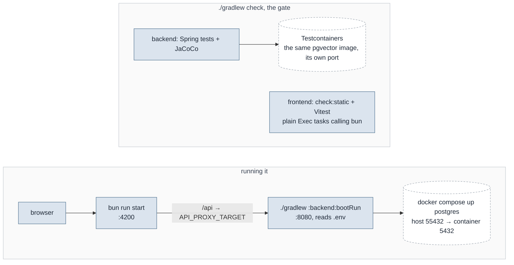

# Development

## Prerequisites

| Thing    | Version    | Note                                                                                                                                         |
|----------|------------|----------------------------------------------------------------------------------------------------------------------------------------------|
| JDK      | **25**     | Pinned through the Gradle toolchain, not taken from the ambient JDK — that is what makes the build produce the same bytecode here and in CI. |
| Gradle   | —          | Use the wrapper (`./gradlew`).                                                                                                               |
| bun      | **1.3+**   | The package manager for the frontend. Never npm or npx.                                                                                      |
| Docker   | any recent | Required for `docker compose`, **and for `./gradlew :backend:test`** — the backend tests use Testcontainers.                                 |
| Postgres | 18         | Supplied by Compose. Published on host port **55432**, not 5432.                                                                             |
| GraalVM  | **25**     | Only for `./gradlew :backend:nativeCompile`. `check`, `bootRun` and `docker compose` need an ordinary JDK 25 and never look for it.          |

The host port is 55432 on purpose: a developer machine usually already has a Postgres on
5432, and connecting to the wrong one fails as `password authentication failed for user
"leadgen"` — a message naming the user and neither the host nor the database it actually
reached. `DatasourceBanner` prints the effective JDBC URL at startup for the same reason.

## Commands

```bash
./gradlew check                # both modules — the gate
./gradlew :backend:test        # Spring tests
./gradlew :backend:bootRun     # API on :8080, reads the untracked .env from the repo root
./gradlew spotlessApply        # palantir-java-format, unused imports, the SPDX header and
                               # ktlint on the .gradle.kts files; spotlessCheck runs inside
                               # check. A disagreement is settled with one reviewed
                               # spotlessApply, never with -x spotlessCheck

docker compose up postgres     # just the database a local run expects
docker compose up --build      # the whole stack
docker compose -f docker-compose.yml -f docker-compose.demo.yml up --build   # …with the demo data

SMOKE_IMAGE=leadgen-api:aot backend/smoke/smoke.sh    # what has to work in a finished image
IMAGE=leadgen-api:aot backend/smoke/measure.sh        # …and how it compares; needs that stack up

cd frontend
bun run start                  # dev server :4200, proxies /api to API_PROXY_TARGET
bun run check:static           # ESLint (--max-warnings 0), Stylelint, tsc
bun run test                   # Vitest
bun run test:coverage          # …with a v8 coverage report
```

`./gradlew check` is the whole gate: JaCoCo and the Spring tests for the backend,
lint and Vitest for the frontend. The frontend is bracketed with plain `Exec` tasks calling
`bun` rather than with the Node Gradle plugin — the plugin does not speak bun, and this way
`package.json` stays the single list of frontend commands and `bun run <script>` behaves
identically inside and outside Gradle.



## Checking a finished image

`./gradlew check` is the authority on behaviour. It cannot see the failures that are
properties of *how the artifact was built* rather than of the code in it — a missing
reflection hint in a native image compiles, starts, reports healthy, and then returns an
empty result from one stage. `backend/smoke/smoke.sh` is for those.

```bash
docker build -f backend/Dockerfile -t leadgen-api:local .
SMOKE_IMAGE=leadgen-api:local backend/smoke/smoke.sh
```

It brings up its own stack under the compose project `leadgen-smoke` — Postgres inherited
verbatim from `docker-compose.yml`, plus GreenMail and WireMock — runs the image under test
against it, and tears the whole thing down on exit. It never touches the development
volume. `SMOKE_KEEP=1` leaves the stack up to poke at.

Seven groups, twenty-four checks, each one a path that only breaks in a compiled image:
the context boots and is not a GraalVM fallback; all migrations ran and the `vector`
extension is there; all four configuration files bound, one off disk and three off the
classpath, which is the direction a native image breaks; a cover letter rendered through
Freemarker; IMAP connected and read a mailbox; and a stubbed model response came back
through the vendor SDK's deserializer.

`SMOKE_LLM_PROVIDER=anthropic` runs the last group against the Anthropic wire format
instead of the OpenAI-compatible one. Both are worth running before publishing a native
image: they are different SDKs, and only one of them ships its own reachability metadata.

CI runs this suite: the `images` job of `.github/workflows/ci.yml` builds the backend image
and smokes it, which is also the only startup number worth comparing between runs.

`backend/smoke/measure.sh` is the same stack's measuring instrument and is run separately,
against a stack that is already up — `smoke.sh` does not call it, because it sleeps 60 s per
round. It reports image size, two startup numbers and memory at two points, five rounds by
default, because a single before-and-after pair on a laptop is inside the noise. The
numbers it has produced so far, and what they meant, are in
`docs/decisions/native-image.md`.

## Moving an existing database to a new Postgres major

A one-time step per instance, and it is written out here rather than shipped as a script
because it destroys a volume and wants a person watching it.

The reason it cannot be skipped: Postgres 18 scoped `PGDATA` by major version, and the
container silently ignores a volume mounted at the old `…/postgresql/data`. It then starts an
empty cluster, Flyway applies every migration green, and the application serves an empty
working list while the data is still sitting in the volume. Nothing in the log says so. The
mount target in `docker-compose.yml` is `/var/lib/postgresql` for exactly this reason, and a
future major moves the image tag, `PGDATA` and the mount in one edit.

The volume is named after the Compose project, which is the directory name unless
`COMPOSE_PROJECT_NAME` says otherwise — check with `docker volume ls` rather than assuming it.

**Step 2 removes the volume, and that is not tidiness.** Docker seeds a volume from the image
only when the volume is empty at first mount, so retargeting a volume that still holds the old
cluster hands the new major a directory with `PG_VERSION`, `base/` and `global/` lying at its
root. The new major does not read those, does not complain about them, and initdbs its own
cluster into a subdirectory of the same volume. Two clusters then share one volume, which is
the same silent-empty-database symptom with the rollback tangled up in it as well.

```bash
# 1. dump from the still-running old major, and note the count you expect to see again
docker compose exec -T postgres pg_dump -U leadgen -Fc leadgen > leadgen-old.dump
docker compose exec -T postgres psql -U leadgen -d leadgen -tAc 'SELECT count(*) FROM offer'

# 2. copy the old volume aside. Do NOT delete it yet — this is the whole rollback
docker compose down
docker volume create lead-generation_postgres-data-old
docker run --rm -v lead-generation_postgres-data:/from \
  -v lead-generation_postgres-data-old:/to alpine sh -c 'cp -a /from/. /to/'
docker volume rm lead-generation_postgres-data

# 3. bring the new major up on an empty volume and let it initdb
docker compose up -d postgres
docker compose exec -T postgres psql -U leadgen -d leadgen -c 'SELECT version()'

# 4. restore, then verify before anything else touches the database
docker compose exec -T postgres pg_restore -U leadgen -d leadgen --clean --if-exists \
  < leadgen-old.dump
docker compose exec -T postgres psql -U leadgen -d leadgen \
  -c "SELECT extname, extversion FROM pg_extension WHERE extname = 'vector'" \
  -c 'SELECT count(*) FROM offer' \
  -c "SELECT indexname FROM pg_indexes WHERE indexname LIKE '%embedding%'"
```

Expected at the end: the extension at the image's own version, the offer count from step 1,
and both `idx_offer_embedding` and `idx_offer_retrieval_embedding` back. The dump carries
`flyway_schema_history` with it, so Flyway sees every version applied and re-runs nothing.

Only once the count matches: `docker volume rm lead-generation_postgres-data-old`.

## Where the settings come from

Everything individual lives in two gitignored places: `.env` at the repository root, and
`config/` beside it. Neither is committed, and the tool runs without either — the defaults
ship on the classpath. Start from [`.env.example`](../.env.example); the full list of keys
is in [CONFIGURATION.md](CONFIGURATION.md).

`.env` is read by the application itself, not by the build, and it is searched upwards from
the working directory with real environment variables winning. That matters because the
working directory is not one thing: `bootRun` runs in `backend/`, an IDE run configuration
in the repository root, a jar wherever it sits. It used to be a `bootRun` hook, which meant
launching the very same configuration from an IDE silently saw none of it.

Compose reads the same file, and it has to be called `.env`: Compose substitutes the
`${...}` in `docker-compose.yml` from `.env` and from nothing else — not from `env_file:`,
which only injects into a container.

**Reading a run:** the backend prints a one-box configuration banner on startup naming, per
setting, the effective value and which layer decided it, with credentials masked. The dev
server prints its effective proxy target (`[proxy] /api → …`). Those two lines are the first
place to look for an unexplained empty list.

## The demo dataset

`demo/` holds an invented corpus, profile and rule set so a fresh clone opens on a populated
application. It is also the fastest way to exercise a change end to end without a mailbox.
See [`demo/README.md`](../demo/README.md).

## The reference implementation

`docs/samples/analyze_samples.py` and `docs/samples/simulate_filter.py` are the reference:
whatever they do, the Java has to reproduce, and the numbers in
[SAMPLE-ANALYSIS.md](SAMPLE-ANALYSIS.md) are the target values. They are the only Python in
the repository and they stay.

```bash
python3 docs/samples/analyze_samples.py    # extraction, field coverage, duplicates
python3 docs/samples/simulate_filter.py    # the hard filters, writing filter-baseline.json
```

Both need `docs/samples/emails/`, which is **gitignored**: the corpus is 14 real newsletter
mails carrying a subscriber's address in every header and unsubscribe link. So on a fresh
clone and in CI, `HardFilterCorpusTest` and `SampleCorpusAcceptanceTest` skip. `ExtractionTest`
covers the same mechanics against a fixture that ships, and the two must stay in step.

## Traps that have already cost time

The full list lives beside the code it is about, in [`backend/CLAUDE.md`](../backend/CLAUDE.md)
and [`frontend/CLAUDE.md`](../frontend/CLAUDE.md); these are the ones a newcomer hits first.

- **`bun run check:static` says nothing about the templates.** `tsc -p tsconfig.app.json`
  does not run the Angular template compiler, so a template type error only surfaces in
  `bun run test` or `bun run build`.
- **Tailwind 4 scans source *text* for class names.** A class assembled at runtime
  (`'badge-' + tone()`) is never emitted into the stylesheet — it exists in the DOM and
  nowhere else. Spell every variant out in a literal lookup map.
- **A component class name must not collide with a DaisyUI component class.** DaisyUI ships
  `status`, `label` and others; a header span classed `.status` was silently laid out as an
  8 px dot.
- **Router input binding writes `undefined` for an absent query parameter**, overriding the
  input's declared default. Every routed input needs `transform: (value) => value ?? …`.
- **Verify UI changes in a real browser, not only in the suite.** Renaming the root
  component's selector without editing `src/index.html` leaves every unit test passing and
  the page blank, with nothing in the console.
- **A backgrounded browser tab suspends `requestAnimationFrame`, `ResizeObserver` and CSS
  transitions** without erroring, so anything animated or viewport-dependent measures as
  "nothing happened". Measure those in a foreground window.
