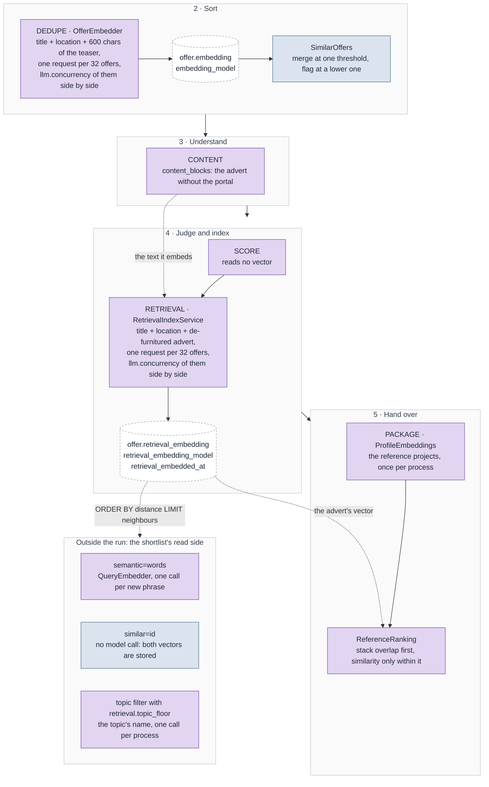
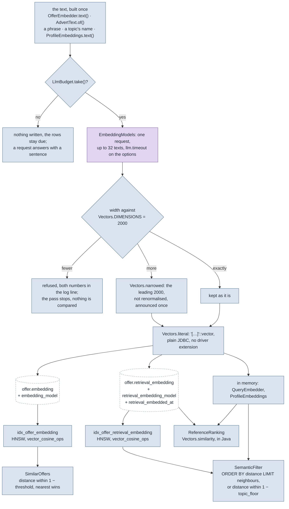
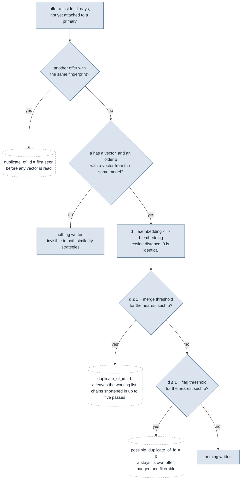
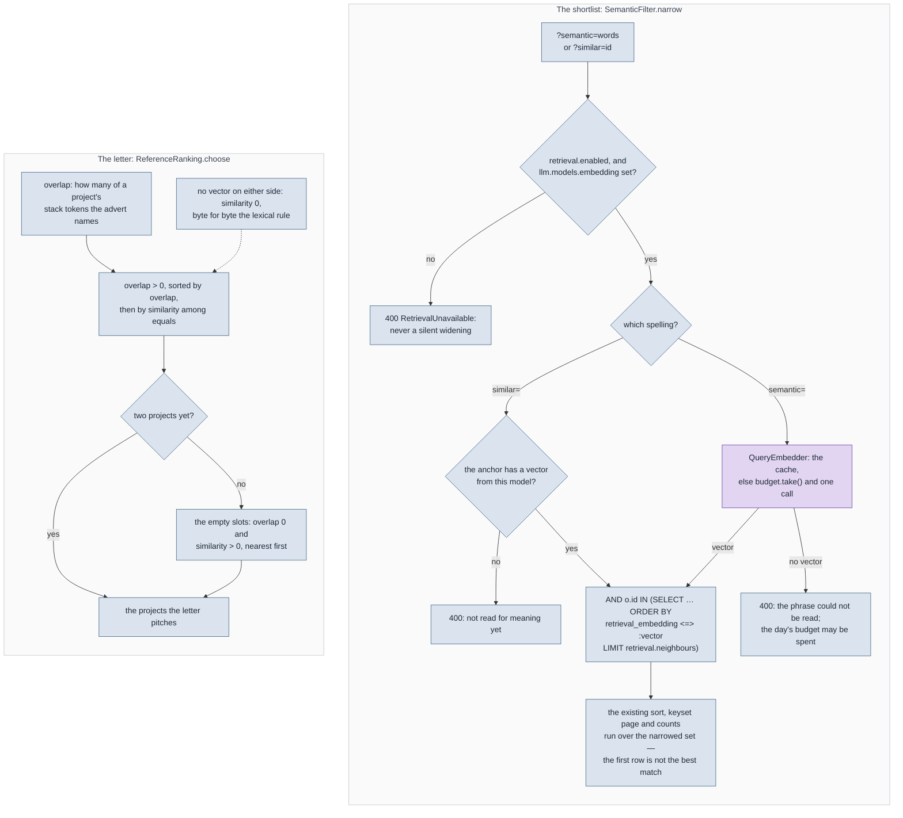

# Embeddings

What this tool turns into a vector, when, where the vector lands, and what it is allowed to
do once it is there. Two columns on `offer` hold vectors and three more live in memory; five
readers act on them, and not one of those readers is allowed to pass, fail, score or rank an
offer on a vector alone. The measurements that set every threshold are in the decision
records and are linked, not repeated; the tables are in [DATA-MODEL.md](DATA-MODEL.md), the
run they sit in is in [BACKEND-FLOWS.md](BACKEND-FLOWS.md).

> [!NOTE]
> Derived from the code under `backend/src/main/java/de/codeministry/leadgen/` — `llm/Vectors`,
> `llm/EmbeddingModels`, `dedupe/OfferEmbedder`, `dedupe/SimilarOffers`, `retrieval/*`,
> `packaging/ProfileEmbeddings`, `packaging/ReferenceRanking` — and the migrations `V22`,
> `V25` and `V26`. Where a diagram and a class disagree, the class wins and the fix is here. The
> diagrams share the colour scheme of the other guides, described in
> [README.md](README.md#conventions-in-the-guides): grey-blue is deterministic and free, violet
> asks a model, a dashed white box is a database row.

## 0. The five vectors

One embedding model, named by `llm.models.embedding` in `pipeline.yaml`, serves every vector
below. There is no second key and no fallback to the scoring model: a chat model is not an
embedding model, and asking one for a vector is an error rather than a worse answer.

| Vector of | Text, built by | Lives in | Written by | Read by |
|---|---|---|---|---|
| an offer, for deduplication | title, location, the first 600 characters of the teaser — `OfferEmbedder.text()` | `offer.embedding`, with `embedding_model` | `DEDUPE` | `dedupe/SimilarOffers`: merge above one threshold, flag above a lower one |
| an offer, for retrieval | title, location, the de-furnitured advert capped at 6000 characters — `retrieval/AdvertText.of()` over `ContentText.of()` | `offer.retrieval_embedding`, with `retrieval_embedding_model` and `retrieval_embedded_at` | `RETRIEVAL` | `retrieval/SemanticFilter` for `semantic=`, `similar=` and the topic floor; `packaging/PackagingService` for the letter |
| a search phrase | the phrase, stripped | `retrieval/QueryEmbedder`, 256 phrases in memory | the first `semantic=` request for those words | the same request's `IN (…)` clause |
| a profile topic's name | the name | the same cache | the first shortlist request with that topic, once a `retrieval.topic_floor` is set | `SemanticFilter.topicNeighbourhood` |
| a reference project | title, role, stack and the pitch, in the letter's language — `ProfileEmbeddings.text()` | `packaging/ProfileEmbeddings`, keyed by model and a digest of the text | the first package built in that language | `packaging/ReferenceRanking` |

The two columns are the same width and the same index kind, and they must never be compared
with each other. § 3 says why there are two.

## 1. Where the vectors enter the run

Two of the eleven fixed stages write a vector and one reads it; everything else that touches
a vector happens outside the run, on a request. The phases are the reading aid
[BACKEND-FLOWS.md § 1](BACKEND-FLOWS.md#1-the-run) uses; the stage names are the ones
`pipeline_stage` records.

Three things the picture says that prose states less well. `DEDUPE` runs before the advert
exists, so its vector can only hold the teaser; `RETRIEVAL` sits two phases later than its
input is ready, because its first pass over a corpus is hundreds of requests and in front of
the judge that backfill would spend the day's budget on a search instead of on the shortlist
(the argument is in [decisions/retrieval.md](decisions/retrieval.md) § *The stage sits after
SCORE*). And `SCORE` reads no vector at all: nothing a vector produces reaches
`offer_score_reason`, which is § 7.

## 2. From text to column

Every vector takes the same path, whichever of the five it is: a text built in one place, one
budgeted request, a width check at the seam, pgvector's text literal over plain JDBC, and an
HNSW index the readers' `<=>` can use. `llm/Vectors` is the one implementation of the seam —
it started as three statics on `OfferEmbedder`, and a second stage copying them is how a
vector ends up written at the wrong width into a column that accepts it.

**The text.** Two builders, one per column, and each is mirrored character for character by
`docs/samples/measure_embeddings.ts`, which is what makes a measurement taken outside the
application a measurement of the application. `OfferEmbedder.text()` caps the teaser at
`DESCRIPTION_CHARS` because a page of the client's culture makes two different projects from
one agency look alike; `AdvertText.of()` takes the whole advert but only the part the content
stage kept — `ContentText.of()` returns the `CONTENT` blocks when the advert was segmented and
`full_text` when it was not — and caps it at `ADVERT_CHARS`, a cap that is about dilution and
not about a server limit (the javadoc on that constant carries the measurement). The location
is in both texts for the same reason: two spellings of one place are one place to a vector
and two strings to the exact fingerprint.

**The request.** `EmbeddingModels` builds one client per distinct configuration and caches it
across runs, so a key added to `.env` works without a restart and a nightly run does not open
a fresh connection pool. The `ollama` and `openai-compatible` provider kinds share the one
client at two addresses; the `anthropic` kind has no embedding endpoint and is refused by
name rather than approximated with another vendor's URL. A request carries up to 32 texts and
counts as **one** call against `llm.budget.max_calls_per_day`, the same as one judge's prompt.
`DEDUPE` and `RETRIEVAL` hand their 32-advert batches to `BoundedWork`, which keeps up to
`llm.concurrency` of them in flight side by side; at the default of 1 that is the plain loop.
Each batch writes only its own rows and none reads a vector another one wrote, so the order
they finish in changes nothing. A refused `take()` stops the stage handing out further batches,
the ones already in flight finish and keep what they wrote, and the rest stays due, so nothing
is ever written as embedded that was not embedded. The width moves the clock, not the count:
the same pass is the same number of requests at any width.

**The width.** Both columns are `vector(2000)`, because 2000 is the widest `vector` pgvector
will build an HNSW index on, and an index cannot be built on a column of unstated width. A
model that returns fewer dimensions is refused at the seam with both numbers in the sentence,
and the pass stops rather than storing a vector nothing can compare. A model that returns
more is cut to its leading 2000 and says so once per process: sound for a model trained with
Matryoshka representation learning, where the leading dimensions carry the separation, and
measured twice before it was allowed ([decisions/pipeline-dedupe-filter.md](decisions/pipeline-dedupe-filter.md)
§ *The two similarity strategies*, [decisions/retrieval.md](decisions/retrieval.md) § *Before
any of this is switched on*, item 3). The cut vector is not renormalised: `<=>` divides by
both lengths and compares direction only.

**The column and its model name.** A vector is written beside the name of the model that
produced it, and every reader compares two rows only when the names match. Two models are two
spaces; the cosine between a vector from each is a number rather than an error, and the guard
is the only thing between that number and a merge. A row embedded by another model is due
again and re-embedded, never compared. The retrieval column carries a third field,
`retrieval_embedded_at`, because it has a staleness the model name cannot see: the content
stage rewrites `content_blocks` when a portal changes its markup, and a vector of the old text
under an unchanged model name is exactly that. `RetrievalIndexService.DUE` therefore asks
three questions — never embedded, embedded by another model, embedded before `content_at` —
and `V26` adds a partial index on `content_at WHERE retrieval_embedded_at IS NULL` for the
nightly due query.

**The index.** HNSW and not IVFFlat on both columns, because IVFFlat has to be built on a
populated table to choose its lists and both columns start empty on every installation. The
operator class is cosine, which is the operator the strategies name; an index built for a
different distance would be ignored rather than used badly.

> [!WARNING]
> **The configured number is a similarity and the operator is a distance.** `<=>` grows as two
> things get less alike, so a merge threshold of 0.97 in `matching-rules.yaml` is a distance
> limit of 0.03 in `SimilarOffers`, and `retrieval.topic_floor` is subtracted from one the same
> way. Reading one as the other does not fail: it merges everything or nothing, and both look
> like a plausible day. `Vectors.similarity` is named for its sign for the same reason.

## 3. Two columns, and why not one

`offer.embedding` answers *are these two postings the same project*; `offer.retrieval_embedding`
answers *what is this engagement about*. Those are two texts, not two settings of one knob,
and the fact that both happen to use one model is what makes them look like one.

Re-using the dedupe column for retrieval would have been the cheap-looking option, and it
cannot be made safe. After a re-embed some rows would carry the vector of the short text and
some the vector of the whole advert **under the same model name**; the `embedding_model` guard
would pass, and the cosine between two incomparable vectors is a number. The ordering makes
the mixture permanent: `DEDUPE` runs at position 2 and the advert does not exist until `ENRICH`
and `CONTENT` have run, so there is no run after which the population is homogeneous. The
reverse — deduplicating on the advert text, which the measurement found to be the *more*
discriminating of the two — fails on the same ordering: it would mean fetching duplicates
before collapsing them. The argument, the paired measurement and the prediction it refuted
are in [decisions/retrieval.md](decisions/retrieval.md) § *Two vectors, because they answer
two questions*.

> [!IMPORTANT]
> `SimilarOffers` reads `offer.embedding` and nothing else; `SemanticFilter` and the packager
> read `offer.retrieval_embedding` and nothing else. Nothing may compare one column against
> the other, and the measured merge and flag bands belong to the teaser text alone.

## 4. Deduplication: merge, flag, or nothing

`DEDUPE` runs three strategies in the order `matching-rules.yaml` lists them, and the order is
the point: `exact_fingerprint` costs nothing and resolves what it can before a vector is
asked for. Only then does `OfferEmbedder` fill the column for every offer inside
`deduplication.ttl_days` that has no current vector and is neither merged nor archived, and
`SimilarOffers` runs the two `embedding_cosine` strategies over the window.

The shape of the two statements decides more than the two numbers do:

- **The nearest older neighbour, not any neighbour.** Each strategy is one `UPDATE` reading a
  CTE that selects, per offer, the single closest row inside the limit that is older by
  `(ingested_at, id)`. Older is always the primary, which makes the relation antisymmetric and
  the pass idempotent: a second run assigns what the first did.
- **Similarity is not transitive**, so there is no equivalence class to compute the way the
  exact pass does with `first_value`. One statement can leave A attached to B while B goes to
  C; `FLATTEN` shortens the chain afterwards, in up to five passes, and logs if any remain.
- **A flag writes its own column.** `duplicate_of_id` decides what the working list shows, and
  a maybe written into it would hide an offer. The shortlist badges
  `possible_duplicate_of_id` and can filter on it; the row stays its own offer.
- **Both strategies see only rows with a vector from the configured model**, and
  `OfferEmbedder` skips archived rows, so the similarity strategies are scoped to the working
  list while the exact fingerprint is not. The asymmetry is deliberate and measured; the
  paragraph is in [decisions/pipeline-dedupe-filter.md](decisions/pipeline-dedupe-filter.md)
  § *The two similarity strategies*.
- **No transaction around the pass.** A vector is an HTTP call, and a transaction held across a
  few hundred of them is held for minutes. Every statement is atomic on its own, and a run
  that dies halfway is repaired by the next one.

The shipped `matching-rules.yaml` merges at `0.97` and flags at `0.95`; a threshold outside
`(0, 1]` is refused by name rather than clamped, because a `92` meant as a percentage would
merge the whole window into one offer. Where those two numbers come from is § 6.

## 5. Retrieval: the search narrows, and the letter picks

The retrieval vector has two readers, and both are arranged so that the vector chooses a
*set* and never an *order*. Every path in the picture answers deterministically before a
model is asked, and every refusal is a sentence rather than a silently widened list.

**Why a filter and not a seventh sort.** A relevance order would make `ShortlistSort`'s key
expression a function of the request, need a fourth cursor kind carrying a float, and could
not stop a cursor minted under one query text being replayed against another — identical
bytes, different meaning, silently. A filter narrows the set without redefining the key, so
the ten sorts, the keyset page and the counts run unchanged over the neighbourhood. The
consequence is visible on the screen and worth knowing: **the first row is not the best
match**, because there is no such thing here. `retrieval.neighbours` is a *count*, which is
why this could ship before the retrieval space had a measured threshold — a ranked list
bounded by `LIMIT` needs no cutoff nobody has evidence for. `similar=` costs no model call at
all, because both vectors are already in the table, and the anchor is checked first: a scalar
subselect for an offer with no vector is `NULL`, `<=>` against `NULL` is `NULL` for every
row, and `ORDER BY NULL … LIMIT k` returns k arbitrary offers under a chip naming the anchor.
`SemanticFilter.available()` is the capability flag the read side reports so the browser can
leave the control out entirely, and `coverage()` is two counts — how many working-list offers
have a vector from this model, out of how many — so a short result in the first weeks reads
as "not indexed yet" rather than as a quiet market.

**The topic filter's paraphrase half.** With `retrieval.topic_floor` set, the shortlist's
topic filter is widened by adverts whose retrieval vector lies within that cosine of the
topic's *name*, OR-ed onto the alias matches the scorer stored. Unlike `semantic=` this never
refuses: a topic has a complete answer without the index, so no model, no floor, no budget and
no index all yield the alias matches alone. It widens one filter and nothing else — no score
moves. The floor is a similarity on a column, so it is measured before it is set (§ 6) and is
unset in the shipped file.

**The letter.** `PackagingService.referencesFor` hands `ReferenceRanking.choose` three things:
the lexical overlap per project, the offer's retrieval vector as `Vectors.parse` reads it off
the row, and the profile's vectors from `ProfileEmbeddings` in the letter's language. The
comparator sorts on overlap first and on similarity only within equal overlap, so *a project
whose stack the advert names is never outranked by one the model merely likes* — by
construction, not by a later reader's care. The model speaks in exactly the two places the
rule is silent: it breaks ties, and it fills the slots the old `overlap > 0` filter used to
leave empty, which is how a letter used to go out pitching one project or none. Without
vectors on either side every similarity is zero, and the output is byte for byte what the
lexical rule produced before. The reference projects are embedded once per project and
language — the pitch is content and is compared against an advert in its own language — and
cached by model plus a digest of the text, so an edited pitch re-embeds itself alone and hot
reload stays free.

## 6. Thresholds, and how they are measured

Three numbers in the shipped configuration are similarities, one is a count, and the
difference decides what has to happen before each may change.

| Key | File | Kind | Measured with |
|---|---|---|---|
| `deduplication.strategies[].threshold`, action `merge` (shipped `0.97`) | `matching-rules.yaml` | similarity on `offer.embedding` | `docs/samples/measure_embeddings.ts`, `--text=teaser` |
| `deduplication.strategies[].threshold`, action `flag_possible_duplicate` (shipped `0.95`) | `matching-rules.yaml` | similarity on `offer.embedding` | the same run |
| `retrieval.topic_floor` (shipped unset) | `pipeline.yaml` | similarity on `offer.retrieval_embedding`, against a topic's name | `docs/samples/measure_topic_floor.ts`, from a labelled sample |
| `retrieval.neighbours` (shipped `200`) | `pipeline.yaml` | a count | nothing: a count needs no band |

`measure_embeddings.ts` takes the working list as JSON and a model name, embeds every offer
through the same `/embeddings` request shape `EmbeddingModels` uses, caches the vectors per
model and text mode so a second cut is free, and prints how many pairs sit at or above each
band **with both titles of every pair**. That last part is the rule the script exists for: a
table of similarities nobody can check against the adverts behind them is a table nobody
should act on. An optional second argument truncates every vector to that many dimensions,
which is the one question it was added for — whether a model wider than the column still
separates the corpus at 2000. Its `--text=advert` mode mirrors `AdvertText.of` the way the
default mirrors `OfferEmbedder.text()`, and the two modes are run over **one** input file:
pair counts grow with the square of the row count, so band tables over two corpora are not
comparable even when both are right.

`measure_topic_floor.ts` answers a different comparison — a few words against a few thousand
characters — from a person's labels: the offers nearest to a topic's name that carry none of
its aliases, each ticked as really about the topic or not, and for every candidate floor how
many it would add and how many of those are right. `measure_references.ts` is the check for
§ 5's letter: per advert, what the lexical rule picks, what similarity alone would pick and
what the blend picks, by project title, so the change can be argued with by hand.

What the scripts found, with the numbers, is in
[decisions/pipeline-dedupe-filter.md](decisions/pipeline-dedupe-filter.md) § *The two
similarity strategies* and [decisions/retrieval.md](decisions/retrieval.md); the outputs
themselves name real adverts and stay out of the repository. Two rules follow from how they
were taken:

- **Re-measure before changing a threshold, and re-measure before changing the model.** The
  bands are a property of the model and the market, not of the number: the two thresholds the
  file first shipped with were both wrong for the model that was first to hand, and the
  measurement is what said so.
- **A threshold acts only on the text it was measured against.** The merge and flag bands were
  taken on `OfferEmbedder.text()` and act on `offer.embedding`; the retrieval column shipped
  with no threshold at all, and `neighbours` is a count precisely so that it needed none.

## 7. What a vector may never decide

*Rules before model* is the repository's first invariant, and for vectors it has a specific
shape. Each line below holds in the code by construction, not by convention:

- **A vector never passes or fails a knockout.** The six filter stages read `matching-rules.yaml`
  and `skill-profile.yaml` and nothing else; `FILTER` reads no column a model wrote.
- **A vector never moves a score.** `SCORE` reads neither column. The topic filter's paraphrase
  half widens one shortlist filter; the scorer's stored topic match is text against aliases.
- **A vector never ranks the shortlist.** `semantic=` and `similar=` select a bounded set and
  the existing sort orders it; there is no relevance sort and no relevance cursor.
- **A vector never merges two offers without a threshold that stands in `matching-rules.yaml`**,
  and never merges above the flag band alone — the flag is its own column.
- **A vector never outranks a lexical match in the letter.** Overlap first, similarity within it.
- **A vector is never compared across models, and never across the two columns.** The model
  name beside each column is the guard for the first; § 3 is the rule for the second.
- **A vector never decides in silence.** `semantic=` and `similar=` refuse with a 400 and a
  sentence rather than return the unfiltered list under a heading that says it was narrowed;
  the packager pitches yesterday's projects rather than silently worse ones.
- **Nothing is selected out of a CV, no few-shot examples are retrieved for the judge, and no
  question is answered over the whole corpus.** Each was considered and refused;
  [decisions/retrieval.md](decisions/retrieval.md) § *What was refused* carries the reasons.

## 8. Without an embedding model

The tool runs on a fresh clone with `llm.models.embedding` empty, and this is what each reader
does then. The same rows apply when the provider kind has no embedding endpoint, when the
model answers with fewer than 2000 dimensions, and — per request — when the day's budget is
spent.

| Reader | With no embedding model |
|---|---|
| `DEDUPE` | `exact_fingerprint` runs alone; one `INFO` line says so. No warning, because this is the shipped state |
| `RETRIEVAL` | skipped, and the column stays empty. Also skipped with `retrieval.enabled: false`, which is the shipped default — a model configured for the measured deduplication must not silently switch on an indexing pass that is not |
| `semantic=`, `similar=` | `400 RetrievalUnavailable` with a sentence; `SemanticFilter.available()` is false and the browser leaves the control out |
| the topic filter | the stored alias matches alone, which is a complete answer; empty is never an error here |
| `PACKAGE` | `ProfileEmbeddings.forLanguage` returns an empty map, every similarity is zero, and `ReferenceRanking` is the lexical rule byte for byte |
| a spent budget mid-pass | `DEDUPE` and `RETRIEVAL` hand out no further batch, let the ones in flight finish and leave the rest due; a `semantic=` request gets the sentence above; the packager keeps whatever profile vectors were already cached and ranks the rest lexically |

## 9. What it costs

Everything here runs against the local endpoint `llm.base_url` names, and nothing falls back
to a paid provider: a failed or slow local call is a refusal that leaves work due, never a
request to another vendor with nothing in the output to show for it. The `anthropic` provider
kind is refused for embeddings by name.

One request carries up to 32 adverts and counts as one call against
`llm.budget.max_calls_per_day`, shared with the judge, the classifier and the field extractor.
The budget counts requests, so `llm.concurrency` shortens a pass without making it dearer; it
pays off only when the endpoint serves that many requests at once, and an endpoint that answers
one at a time merely queues the rest into `llm.timeout`.
The first `DEDUPE` pass after a model is configured, and the first `RETRIEVAL` pass after the
stage is switched on or the model changes, walk the whole window — a few thousand offers is
over a hundred requests — and clear over several nights, because both due queries are
self-healing and each run continues where the last one stopped. That backfill is documented
behaviour, not a fault, and it is the reason `RETRIEVAL` sits behind `SCORE`. After the first
pass a nightly run embeds only what arrived or changed.

On the read side `similar=` is free, a search phrase costs one call the first time and
nothing the next 255 distinct phrases later, a topic's name costs one call per process, and
the profile's reference projects cost one request per language per process, or per edited
pitch.

> [!WARNING]
> `llm.timeout` reaches an embedding request only because `EmbeddingModels` sets it on the
> request *options* as well as on the client. Spring AI's options substitute a 60 s default for
> a null timeout and then always send a per-call timeout, which overrides the client's — so
> without that line a batch of 32 whole adverts against a local model gave up at 60 s whatever
> the file said. The measurement is in [decisions/retrieval.md](decisions/retrieval.md)
> § *The 60-second ceiling the configuration could not reach*.
