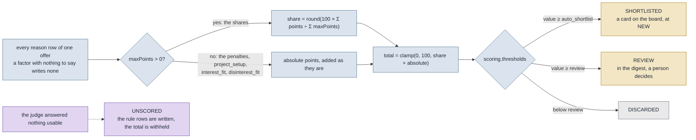

# Writing rules

How to change what survives the filter and what reaches the shortlist, without reading any
Java.

Everything here lives in two files: `matching-rules.yaml` decides the rules, and
`skill-profile.yaml` decides who they are measured against. Both ship as working defaults
inside the jar and are overridden **file by file** from the configuration directory — see
[CONFIGURATION.md](CONFIGURATION.md) for that mechanism. Every example below is quoted from
[`demo/matching-rules.yaml`](../demo/matching-rules.yaml) and
[`demo/skill-profile.yaml`](../demo/skill-profile.yaml), which are committed, fictional and
runnable, so every line is one you can open.

The Rules screen in the frontend is **read-only**. It renders what is loaded; the file is
the only place anything changes.

## What a rule can and cannot do

Two mechanisms, and the difference is what they cost.

A **knockout** is deterministic, free, runs without a network and ends the assessment. Six
of them, in a fixed order, and an offer stops at the first one that rejects it. Roughly four
in five offers never reach a model because of these.

A **weight** or a **penalty** only applies to what survived, and half of them are answered
by a language model. Without a key the tool still runs, the deterministic reasons are still
written, and the score total is withheld rather than computed from half the table.

Nothing in either file can send anything anywhere. There is no recipient and no channel in
the configuration, on purpose.

Why the stages sit in this order at all, and what each change was measured against, is in
[`decisions/pipeline-dedupe-filter.md`](decisions/pipeline-dedupe-filter.md) and
[`decisions/pipeline-scoring.md`](decisions/pipeline-scoring.md). This document is the
how-to; those two are the why.

## Four things that bite before you start

**A typo fails the file — it does not disable a rule.** Binding is strict
(`FAIL_ON_UNKNOWN_PROPERTIES`), and that is deliberate: a misspelled `min_remote_percnt`
would otherwise switch a hard filter off in silence, and the only visible effect is a longer
shortlist, which looks exactly like a good day on the market. The error names the property
path.

**Invalid at startup is fatal, invalid at reload is not.** Running with a filter nobody
wrote is worse than not running. But a half-saved file must not take a running instance
down, so the last good snapshot stays and the problem is logged.

**`skill-profile.yaml` is hot-reloaded too, and a change to it costs no model call.** All four
files are read together and swapped atomically under `rules.hot_reload`. On the next run every
scored offer whose deterministic half was computed against another profile is re-totalled: the
rules half is recomputed and added to the judged rows as they were stored, with `score_model`
and `ruleset_version` left alone. An alias, a topic or a skill weight is therefore live by the
next run and free. Note what else follows the file: the hard filter's core-skill list and the
judge's profile summary change between runs as well.

**Bumping `version:` re-scores the whole standing shortlist at full price.** A score is
considered stale when it was never written, when its `ruleset_version` differs, or when its
`score_model` differs — so the next run re-judges every passed offer, one model call each.
The mirror image is just as important: changing a weight **without** bumping `version:`
leaves every existing score in place, and the new table only applies to offers that arrive
afterwards. Decide which of the two you want before you save.

## How a keyword is matched

Every list in the knockout section is folded through `TextFold`, and so is the text it is
matched against. A keyword is NFKD-normalised, lowercased, stripped of combining marks,
`ß` becomes `ss`, everything outside `[a-z0-9%]` becomes a space, whitespace collapses —
and then it is wrapped in word boundaries and quoted.

Four consequences when you write a list:

- **Entries are literals, not regexes.** They are `Pattern.quote`d, so `.` and `*` mean
  themselves. A regex belongs in `pipeline.yaml`'s `content.rules`, not here.
- **Matching is on word boundaries, never substrings.** `net` will not match `Internet` or
  `Netzwerk`. This is not politeness: `ch` for Switzerland once rejected 127 German offers
  because of Aachen and Bochum, and `ANÜ` once matched Planung.
- **`.NET` and `C#` fold to `net` and `c`.** They still work, because the pattern is folded
  with the same function as the text — but a single-letter entry like `c` matches any
  standalone `c` in a title, which is the one case worth checking after you add it.
- **A multi-word entry is a phrase in order.** `"EU-wide onsite"` folds to `eu wide onsite`
  and matches only that sequence. An entry of pure punctuation folds to nothing and is
  dropped rather than compiled into a pattern that matches everywhere.

## The six knockouts

The six as one funnel, each with the key that drives it, is drawn in
[`ARCHITECTURE.md` § The hard filter](ARCHITECTURE.md#the-hard-filter); this section is the
key-by-key detail behind that picture.

They run in this fixed order, and an offer stops at the first rejection — which is the only
reason the per-stage counts on the dashboard funnel sum to the total. The verdict written on
the offer carries the stage *and* the reason, because a rejection without its reason is a
number nobody trusts a week later.

### 1. `ABROAD` — `hard_filters.location.reject_keywords`

Reads the offer's **location only**. Any entry that matches ends it.

```yaml
location:
  reject_keywords: ["Schweiz", "Österreich", "Zürich", "Wien", "Basel", "London", "USA",
                     "relocation", "onsite abroad", "EU-wide onsite"]
```

This is the first stage on purpose: an offer in Zürich is not worth asking any further
question about.

### 2. `REMOTE_SHARE` — `hard_filters.remote.min_remote_percent`, `.accept_unknown`

Reads **title plus description**, looking for a stated percentage (`(\d{1,3})\s*%\s*remote`,
the one pattern that is in Java rather than in the file). Three behaviours:

| The offer | `accept_unknown: true` (default) | `accept_unknown: false` |
|---|---|---|
| states a share below the minimum | rejected | rejected |
| states a share at or above it | passes | passes |
| states no share at all | passes, flagged | rejected, **but only while `min_remote_percent > 0`** |

The default is `true` and should stay there unless you know why: the measured sources state
a remote share in 8.8 % of offers, so rejecting the rest empties the shortlist.

### 3. `OUT_OF_REACH` — `hard_filters.location.onsite_cities`

Reads the **location**, plus the whole text for remote tokens. An offer passes if it looks
remote, or if its location names a city on the list.

```yaml
location:
  onsite_cities: ["Köln", "Düsseldorf", "Bonn", "Aachen", "Leverkusen", "Neuss",
                   "Wuppertal", "Duisburg", "Essen", "Dortmund", "Koblenz"]
```

**A list, not a radius.** Nothing here geocodes: an offer states its location as free text
— "Remote und Köln", "DE 5XXXX" — so a kilometre figure would need a dataset, a parser and a
network call this stage must not need. Draw the list once off a map.

Two things about this stage in particular:

- **`min_remote_percent: 0` switches it off entirely.** No required remote share means being
  on site is acceptable, and then it is acceptable anywhere, so the city list stops applying.
  Measured before that condition existed: 145 of 254 offers died here while the share was
  already at zero.
- **An empty `onsite_cities` means only remote offers pass.** That is what the shipped
  default does, and on screen it looks exactly like a quiet market. The loader warns about it
  rather than failing, and the Rules screen spells it out as "nowhere — only remote offers
  pass".

The remote tokens come from `remote.derive_from`, and only the `contains_any` entries of it
are read — `field`, `regex`, `set` and `confidence` are ignored at this stage, so a
derivation written for `title` also applies to the location.

### 4. `ROLE_OR_STACK` — `hard_filters.role.rejected_title_keywords`

Reads the **title only**, and nothing else. A stack named deep in a description is not a
reason to discard an offer; a stack in the title is what the project is.

```yaml
role:
  rejected_title_keywords: [SAP, ABAP, Salesforce, .NET, "C#", PHP, ServiceNow,
                            Data Scientist, Scrum Master, Product Owner, Projektleiter,
                            Tester, COBOL, Embedded, iOS, Android, Flutter, Support]
```

**This is not the profile's `disinterest_topics`.** Those sink a score and never end an
assessment; reading them as a knockout as well would mean anyone tuning the score silently
changes what reaches the shortlist. Keep the two apart even where they overlap.

### 5. `NO_CORE_SKILL` — `skill-profile.yaml → core`

The one knockout that lives in the other file. It reads the offer's **tags first, then title
plus description**, and passes if any core skill — or any of its aliases — appears.

```yaml
core:
  - skill: Spring Boot
    weight: 10
    aliases: [Spring, Springboot, Spring Framework, Spring Data, Spring Cloud]
```

**Only `core` is read here.** `strong` and `peripheral` are invisible to the filter; they
count for scoring and nowhere else. And **the aliases are the point**: an ad asking for
"Springboot", "Spring Data" or "k8s" names a core skill, and a list of bare names would
answer no. Measured over the corpus, the aliases are worth twelve offers.

If you widen the filter anywhere, widen it here first — an alias is cheaper and more precise
than lowering a threshold.

### 6. `CONTRACT_FORM` — `hard_filters.contract.rejected`

Reads **title plus description**.

```yaml
contract:
  rejected: [Festanstellung, Arbeitnehmerüberlassung, ANÜ, Personalvermittlung,
             Praktikum, Werkstudent]
```

`contract.allowed` sits beside it in the shipped file and is read by nothing — the stage is
a rejection list, not an allowlist.

## The two rules that are not knockouts

**`hard_filters.rate.min_hourly_eur` never runs in the filter.** The sources state an hourly
rate in 0.0 % of offers, so applied before the enrichment stage this rule filters either
everything or nothing. It is enforced three ways: `FilterStage` has no rate constant, the
loader refuses any `apply_after` but `enrichment`, and a test passes a 5 €/h offer through a
filter with a 60 € floor and asserts it survives.

The number is not idle, though. It is the **rate floor for the `rate_fit` score**: a stated
rate below it scores zero, at or above it scores half the weight, and at 1.2× the floor or
better it scores the full weight. A rate the ad did not state writes no row at all.

**`hard_filters.freshness.max_age_days` archives rather than rejects.** Too old is not a
judgement about an advert — an old advert is a good advert nobody will answer any more — and
a verdict is what the funnel reports. The archive is an axis beside the verdict, and the pass
reconciles: widening the window restores rows the age pass archived itself, and never rows a
person archived by hand. An offer with no publication date is never archived.

```yaml
freshness:
  max_age_days: 21
```

Leaving the `freshness` block out archives nothing.

## The weight table

```yaml
scoring:
  weights:
    core_skill_overlap: 45
    role_fit: 15
    industry_fit: 10
    seniority_fit: 10
    project_setup: 10
    rate_fit: 10
    interest_fit: 15
  penalties:
    stack_mismatch_dominant: -30
    role_mismatch: -25
    vague_description: -10
    disinterest_fit: -20
```

Both maps are open: the keys below are the ones something answers, and a key nothing answers
is simply never earned.

| Key | Answered by | How the points are found |
|---|---|---|
| `core_skill_overlap` | rules, free | `weight × min(1, matched weight ÷ saturation)`. `core` and `strong` count in full, `peripheral` at half. |
| `rate_fit` | rules, free | 0 below the floor, `weight ÷ 2` at or above it, full weight at 1.2× the floor. No row when no rate is stated. |
| `seniority_fit` | rules, free | Full weight for senior/lead/architect, 0 for junior/Werkstudent, **no row** when the ad names neither. |
| `project_setup` | rules, free | **A bonus, not a share:** `round(weight × stated ÷ 3)` over duration, workload and start. |
| `industry_fit` | rules, free | `round(weight × industry.weight ÷ 10)` for the heaviest industry that matched. |
| `interest_fit` | rules, free, and the model | **A bonus, not a share:** `round(weight × topic.weight ÷ 10)` for the heaviest `interest_topics` entry the advert names. The judge may find a topic no alias caught; its row is worth the same and the two never add up. |
| `disinterest_fit` | rules, free, and the model | The same as a penalty, for the heaviest `disinterest_topics` entry, charged once whatever the number of aliases hit. |
| `role_fit` | the model | Judged, then clamped to this weight. |
| `stack_mismatch_dominant` | the model | Penalty, clamped to this value. |
| `role_mismatch` | the model | Penalty. |
| `vague_description` | the model | Penalty. |

**A key you leave out contributes nothing**, and there are no defaults in the code: a weight
table somebody tuned should be the whole story, not a suggestion the code partly ignores.
The same clamp applies to the model — a judge awarding itself 900 points for role fit gets
exactly what `role_fit` says, and a factor it invents is dropped.

### How the total is computed

```
attainable = Σ maxPoints  of every factor that wrote a row with maxPoints > 0
earned     = Σ points     of those same factors
penalties  = Σ points     of the rows with maxPoints == 0   (the penalties, project_setup and the two topic rows)

share = round(100 × earned ÷ attainable)
total = clamp(0, 100, share + penalties)
```



Two things follow from that and are worth having in mind while tuning:

- **A factor with nothing to say writes no row**, so it is in neither the numerator nor the
  denominator. A factor that applied and scored zero *does* write a row and stays in the
  denominator. That is the difference between "this offer pays badly" and "this offer does
  not mention pay" — scoring the second as the first once capped every score in the table at
  53 out of 100.
- **Penalties are absolute.** A `-30` is thirty points off the finished share, not a share of
  something, because the thresholds are read on the same 0–100 scale.

**`saturation_core_count`** is how many of the heaviest core skills an ad has to ask for to
count as a full match. No ad names a whole profile, so measuring against all of them makes
full marks unreachable. Unset means all of them, which is the old shape.

**Unscored is not zero.** With no model configured the deterministic reasons are still
written; what is withheld is the total, because a number from five of nine weights is not
comparable to one from all nine.

## The three thresholds

```yaml
thresholds:
  auto_shortlist: 70
  review: 50
  discard: 0
```

| Band          | Condition                                    | What it gates                                                                                            |
|---------------|----------------------------------------------|----------------------------------------------------------------------------------------------------------|
| `SHORTLISTED` | `value >= auto_shortlist`                    | It gets a card on the board, at `NEW`. The package is built when a person moves that card to `PACKAGED`. |
| `REVIEW`      | `value >= review` and below `auto_shortlist` | Listed in the digest, a person decides.                                                                  |
| `DISCARDED`   | below `review`                               | Neither.                                                                                                 |
| `UNSCORED`    | no value                                     | Always shown in the digest, never put on the board.                                                      |

`review` above `auto_shortlist` is refused at load. It would not fail on its own — the
shortlist bound is tested first — it would silently delete the `REVIEW` band and build a
package for everything above the lower of the two.

`discard` is rendered on the Rules screen and read by nothing; the lower bound is `review`.

## Deduplication

```yaml
deduplication:
  strategies:
    - { type: exact_fingerprint, action: merge }
    - { type: embedding_cosine, threshold: 0.97, action: merge }
    - { type: embedding_cosine, threshold: 0.95, action: flag_possible_duplicate }
  merge_policy: keep_first_seen_as_primary
  ttl_days: 60
```

Closed value sets, and they behave differently when you get one wrong:

- `type` is `exact_fingerprint` or `embedding_cosine`. Anything else is logged and skipped,
  not fatal.
- `action` is `merge` or `flag_possible_duplicate`.
- `threshold` applies to the embedding strategies only and has to be in `(0, 1]`, otherwise
  the strategy is skipped with a warning.
- `merge_policy` accepts `keep_first_seen_as_primary` and nothing else — refused at load.
- `ttl_days` is the window a duplicate is looked for in.

The two embedding strategies only run when `llm.models.embedding` names a model of at least
2000 dimensions; without one, the pass is the exact fingerprint alone. The thresholds were
measured against 2222 real adverts rather than guessed, and the measurement is in
[`decisions/pipeline-dedupe-filter.md`](decisions/pipeline-dedupe-filter.md) — re-measure
with `docs/samples/measure_embeddings.ts` before changing them, because the bands are a
property of the model and the market and not of the number.

## Every key, and what reads it

The shipped file declares more than the code reads. This table says which is which, so a
key you are about to tune is one that does something.

### `hard_filters`

| Key | Type | Read by |
|---|---|---|
| `remote.min_remote_percent` | int 0..100 | `REMOTE_SHARE`, and gates `OUT_OF_REACH` |
| `remote.accept_unknown` | bool | `REMOTE_SHARE` |
| `remote.derive_from[].contains_any` | list | `OUT_OF_REACH` |
| `remote.derive_from[].field` / `.regex` / `.set` / `.confidence` | — | nothing |
| `remote.reject_keywords_de` | list | nothing |
| `location.reject_keywords` | list | `ABROAD` |
| `location.onsite_cities` | list | `OUT_OF_REACH` |
| `location.country_allowlist` | list | Rules screen only |
| `location.onsite_home_base` | string | nothing |
| `location.onsite_exceptions` | list | nothing |
| `rate.min_hourly_eur` | int | the `rate_fit` score — **never the filter** |
| `rate.apply_after` | string | the loader; only `enrichment` is accepted |
| `rate.currency` | string | Rules screen only |
| `rate.accept_unknown` | bool | nothing |
| `rate.reject_below_as` | string | nothing |
| `role.rejected_title_keywords` | list | `ROLE_OR_STACK` |
| `contract.rejected` | list | `CONTRACT_FORM` |
| `contract.allowed` | list | nothing |
| `language.preferred` / `.accepted` / `.english_only_penalty` | — | nothing |
| `freshness.max_age_days` | int ≥ 1 | the archive pass |

### `scoring`, `deduplication` and the rest

| Key | Type | Read by |
|---|---|---|
| `version` | int ≥ 1 | the staleness stamp on every score |
| `scoring.weights.*` | map | the rule scorer and the judge |
| `scoring.penalties.*` | map | the judge |
| `scoring.saturation_core_count` | int ≥ 1, optional | `core_skill_overlap` |
| `scoring.thresholds.auto_shortlist` | int 0..100 | the band, the package gate, the digest |
| `scoring.thresholds.review` | int 0..100 | the band and the digest |
| `scoring.thresholds.discard` | int ≥ 0 | Rules screen only |
| `deduplication.strategies[]` | list | the dedupe pass |
| `deduplication.merge_policy` | string | the loader |
| `deduplication.ttl_days` | int ≥ 1 | the dedupe window |
| `deduplication.fingerprint_fields` | list | nothing — the fingerprint is the normalised title |
| `follow_up.after_days` / `.max_reminders` / `.auto_expire_days` | — | nothing |

The `follow_up` block is worth one extra sentence, because the application board *does* have
follow-ups: they are a date set by hand per application, and nothing connects them to this
block.

### `skill-profile.yaml`

The parts of it that this file's rules are measured against. The rest of the schema is the
file itself — [`demo/skill-profile.yaml`](../demo/skill-profile.yaml) is a complete one.

| Key | Read by |
|---|---|
| `core[].skill`, `core[].aliases` | `NO_CORE_SKILL` **and** `core_skill_overlap` |
| `core[].weight` | `core_skill_overlap` and `saturation_core_count` |
| `strong[]`, `peripheral[]` | `core_skill_overlap` only — invisible to the filter |
| `industries[].name`, `.match`, `.weight` | `industry_fit`. Without `match:`, the name is compared against German ad text. |
| `interest_topics[]`, `disinterest_topics[]` (`name`, `weight` 1-10, `aliases`) | `interest_fit` and `disinterest_fit`, the judge's topic question when the weight row exists, and the shortlist's topic filter. With `retrieval.topic_floor` set in `pipeline.yaml`, the filter also finds adverts whose retrieval vector sits within that cosine of the topic's name; the floor is measured with `docs/samples/measure_topic_floor.ts`, never chosen, and never moves a score. The name is always tried as an alias. A topic lifts or sinks a score and never ends an assessment. |
| `reference_projects[].title_de`, `.title_en`, `.pitch_de`, `.pitch_en` | the cover letter. One of each pair is enough; the other language falls back to it. |
| `reference_projects[].from`, `.to` | the cover letter's period. Months (`"2024-01"`). No `to` means still running, and the letter writes "seit" or "since" itself. |
| `reference_projects[].role`, `.stack` | `ReferenceRanking`, which picks the two projects a letter cites |
| `cv_variants` | which CV goes into the package |
| `locale_primary` | the fallback language of a package, when the ad's own says nothing |
| `identity.*` | the judge's prompt |
| `core[].since`, `industries[].note`, `languages[]` | nothing |

## Checking your work

```bash
./gradlew :backend:test --tests '*HardFilterTest*'        # the six stages and the folding
./gradlew :backend:test --tests '*ConfigLoaderTest*'      # the schema and the refused values
```

Against the real corpus, `docs/samples/simulate_filter.py` is the **reference
implementation**: it reads your `config/matching-rules.yaml` and `config/skill-profile.yaml`,
reimplements the folding and the six stages, and writes what it measured into
`docs/samples/filter-baseline.json`. `HardFilterCorpusTest` then asserts the Java and the
script still agree, offer for offer and stage for stage — so **changing a rule without
re-running the script turns that test red**, which is the point.

One known divergence: the script does not implement `accept_unknown: false`, so the two
disagree the moment that flag is switched off.

Then open the **Rules** screen. It shows the loaded snapshot with the weights as bars and
both system prompts rendered rather than templated, which is the only way to check that the
configured bounds and the profile actually reached the model. Note that the six entries it
lists under knockouts are **not** the six filter stages: it shows `country_allowlist` and the
rate floor, which do not run, and leaves out `ABROAD` and `NO_CORE_SKILL`, which do.
